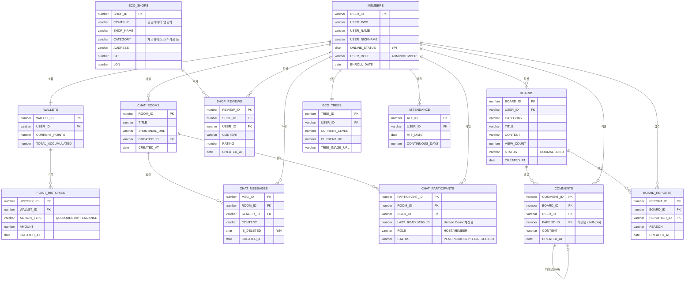

# EasyEarth 프로젝트 ERD (Entity Relationship Diagram)

> **Mermaid `erDiagram` 기반 설계**  
> 이 다이어그램은 5대 핵심 도메인(회원, 채팅, 지도, 커뮤니티, 게이미피케이션) 간의 유기적인 데이터 관계를 시각화합니다.

---

## 📊 1. 전체 도메인 관계도 (Overview)



---

## 🔄 도메인 계층 구조 (Hierarchy View)

> `MEMBERS` 테이블을 중심으로 한 서비스별 데이터 종속성 구조입니다.

```text
MEMBERS (USER_ID)
  ├── WALLETS (USER_ID)
  │     └── POINT_HISTORIES (WALLET_ID)
  ├── ECO_TREES (USER_ID)
  ├── ATTENDANCE (USER_ID)
  ├── CHAT_PARTICIPANTS (USER_ID)
  │     └── CHAT_ROOMS (ROOM_ID)
  │           └── CHAT_MESSAGES (ROOM_ID)
  ├── BOARDS (USER_ID)
  │     ├── COMMENTS (BOARD_ID)
  │     └── BOARD_REPORTS (BOARD_ID)
  └── SHOP_REVIEWS (USER_ID)
```

---

## 📋 테이블 그룹 요약

| 그룹 | 테이블 | 비고 |
|---|---|---|
| 👤 **Identity** | `MEMBERS`, `WALLETS` | 보안 및 경제 생태계의 기초 |
| 💬 **Real-time** | `CHAT_ROOMS`, `CHAT_MESSAGES`, `CHAT_PARTICIPANTS` | WebSocket 기반 실시간 동기화 |
| 🗺️ **Location** | `ECO_SHOPS`, `SHOP_REVIEWS` | 공공 데이터 싱크 및 유저 피드백 |
| 📝 **Governance** | `BOARDS`, `COMMENTS`, `BOARD_REPORTS` | 자정 작용(신고) 및 계층형 소통 |
| 🌱 **Growth** | `ECO_TREES`, `ATTENDANCE` | 사용자 리텐션 및 게이미피케이션 |

---

## ⚡ DB 성능 최적화 전략 (Index Strategy)

조회 성능 극대화 및 커서 기반 페이징을 위해 다음과 같은 인덱스를 설계했습니다.

| 대상 테이블 | 대상 컬럼 | 인덱스 종류 | 기대 효과 |
|---|---|---|---|
| `CHAT_MESSAGES` | `ROOM_ID`, `MSG_ID` | 복합 인덱스 | **커서 기반 페이징** 시 정렬 및 필터링 속도 비약적 향상 |
| `CHAT_PARTICIPANTS` | `ROOM_ID`, `USER_ID` | Unique Index | 중복 참여 방지 및 룸별 멤버 고속 조회 |
| `COMMENTS` | `BOARD_ID`, `PARENT_ID` | Non-Unique | 계층형 대댓글 트리 구조 렌더링 성능 최적화 |
| `BOARD_REPORTS` | `BOARD_ID` | Non-Unique | **Blind System** 처리를 위한 신고 횟수 카운트 성능 개선 |
| `MEMBERS` | `ONLINE_STATUS` | Bitmap Index | 실시간 접속 유저 필터링 및 소셜 상태 동기화 최적화 |
