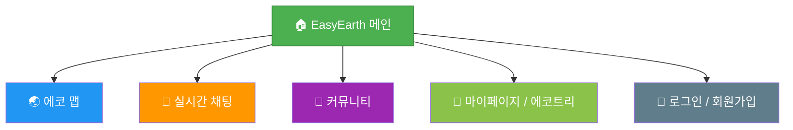
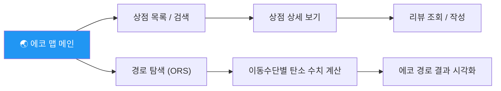
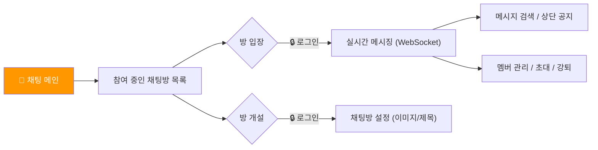
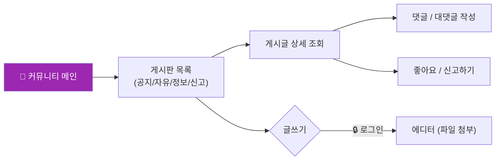
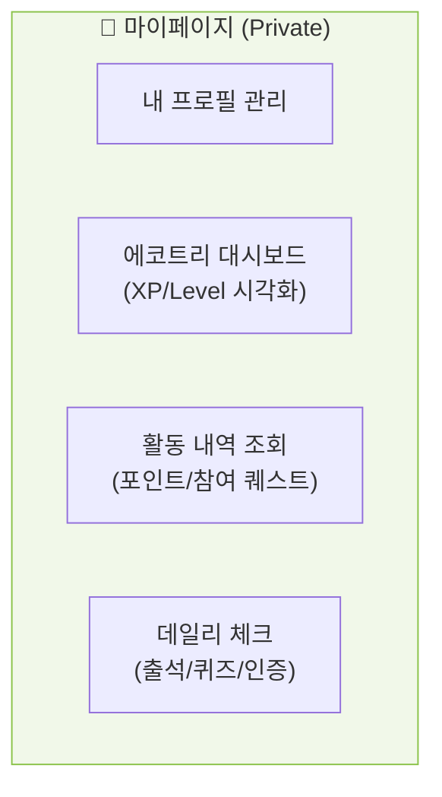

# EasyEarth 프로젝트 IA (Information Architecture)

> **사이트 전체 페이지 계층 구조 및 기능 정의**  
> Mermaid `graph TD` 문법을 활용하여 서비스의 전체 흐름과 접근 권한을 정의합니다.

---

## 목차
1. [전체 사이트 구조 (Overview)](#1-전체-사이트-구조-overview)
2. [도메인별 상세 구조](#2-도메인별-상세-구조)
   - [🌏 에코 맵 (Map & Route)](#에코-맵-map--route)
   - [💬 실시간 채팅 (Messaging)](#실시간-채팅-messaging)
   - [📝 커뮤니티 (Community)](#커뮤니티-community)
   - [🌱 마이페이지 (My & Growth)](#마이페이지-my--growth)

---

## 1. 전체 사이트 구조 (Overview)

상단 내비게이션 바(GNB)를 중심으로 한 메인 계층 구조입니다.

---

## 2. 도메인별 상세 구조

### 에코 맵 (Map & Route)
위치 기반 상점 조회 및 탄소 절감 경로 계산을 담당합니다.

### 실시간 채팅 (Messaging)
유저 간 실시간 소통 및 커뮤니케이션을 담당합니다.

### 커뮤니티 (Community)
환경 보호 활동 공유 및 자유로운 정보 교환을 담당합니다.

### 마이페이지 (My & Growth)
개인 활동 이력 관리 및 에코트리 성장을 담당합니다.

---

## 페이지 목록 및 매핑 명세

| 영역 | 페이지 역할 | Mapping URL | 로그인 | 접근 권한 |
|---|---|---|---|---|
| **메인** | 대시보드/AI 가이드 | `/dashboard` | ❌ | 공통 |
| **에코 맵** | 지도/상점 조회 | `/map`, `/map/detail` | ❌ | 공통 |
| **에코 맵** | 경로 계산 | `/map/route` | ❌ | 공통 |
| **채팅** | 룸 목록/메시징 | `/chat`, `/chat/room/:id` | ✅ | 일반회원 |
| **커뮤니티** | 게시판/상세 | `/community`, `/community/:id` | ❌ | 공통 |
| **커뮤니티** | 글쓰기 | `/community/write` | ✅ | 일반회원 |
| **마이페이지** | 에코트리/프로필 | `/mypage`, `/profile` | ✅ | 일반회원 |
| **마이페이지** | 퀴즈/퀘스트 | `/activity/quiz`, `/activity/quest` | ✅ | 일반회원 |
