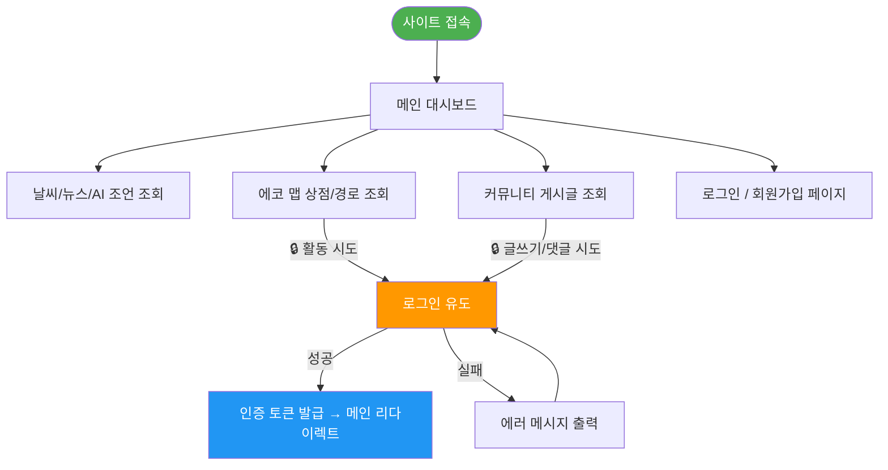
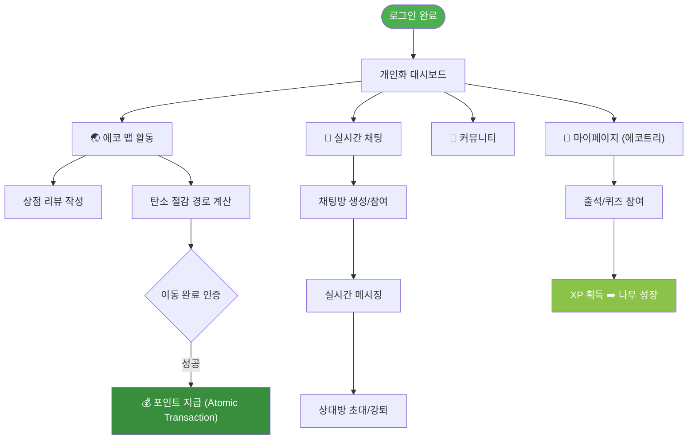
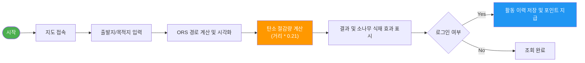
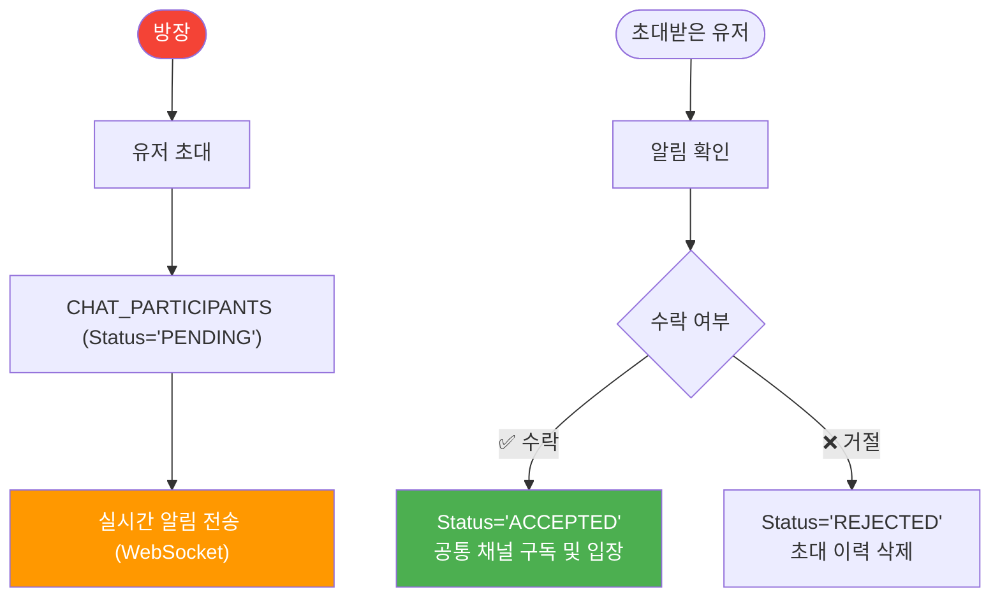
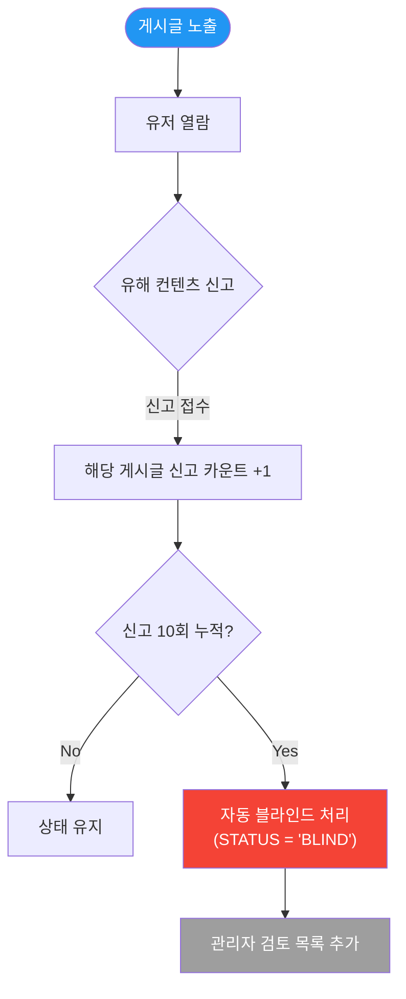
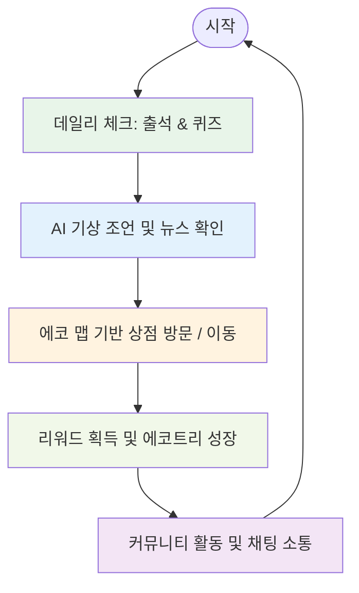

# EasyEarth 프로젝트 User Flow

> **사용자 행동 경로 및 비즈니스 로직 다이어그램**  
> Mermaid `flowchart` 문법을 활용하여 서비스의 핵심 기능별 프로세스와 예외 처리 흐름을 정의합니다.

---

## 목차

1. [역할별 권한 플로우](#1-역할별-권한-플로우)
   - [비로그인 사용자 (Guest)](#비로그인-사용자-guest)
   - [일반 사용자 (Member)](#일반-사용자-member)
2. [핵심 기능별 상세 플로우](#2-핵심-기능별-상세-플로우)
   - [🌏 에코 맵 및 탄소 산출 플로우](#에코-맵-및-탄소-산출-플로우)
   - [💬 실시간 채팅 초대/참여 플로우](#실시간-채팅-초대참여-플로우-asymmetric-process)
   - [📝 커뮤니티 거버넌스 (신고/블라인드)](#커뮤니티-거버넌스-신고블라인드-로직)
3. [통합 서비스 라이프사이클](#3-통합-서비스-라이프사이클)

---

## 1. 역할별 권한 플로우

### 비로그인 사용자 (Guest)

---

### 일반 사용자 (Member)

---

## 2. 핵심 기능별 상세 플로우

### 에코 맵 및 탄소 산출 플로우

---

### 실시간 채팅 초대/참여 플로우 (Asymmetric Process)

---

### 커뮤니티 거버넌스 (신고/블라인드 로직)

---

## 3. 통합 서비스 라이프사이클

