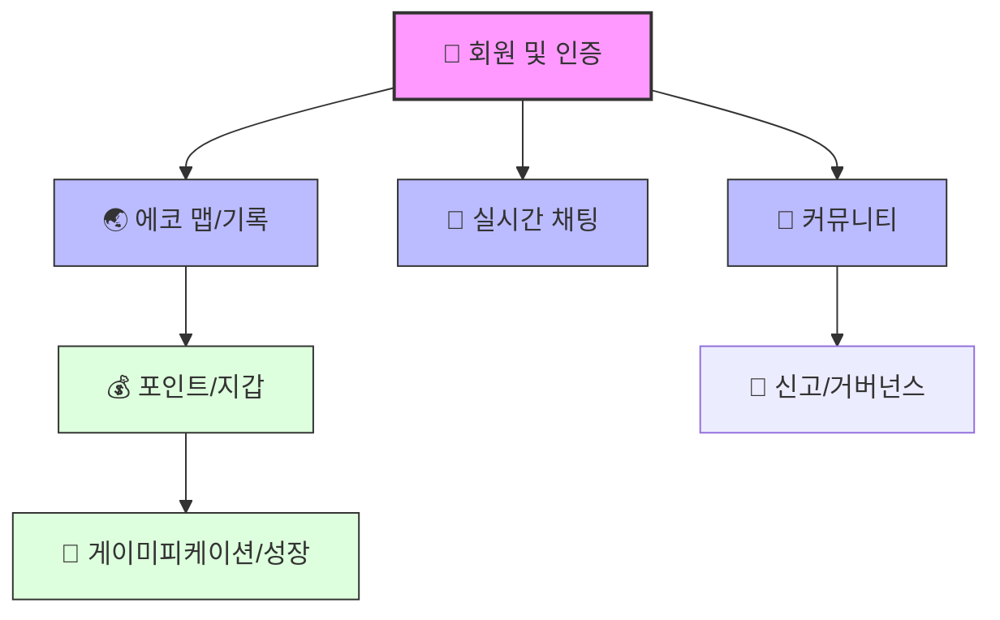
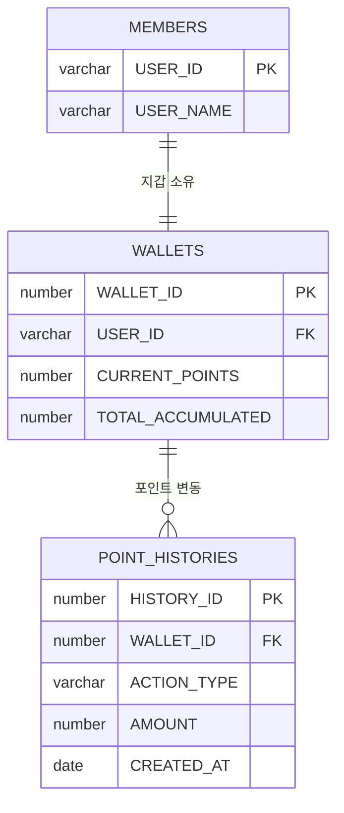
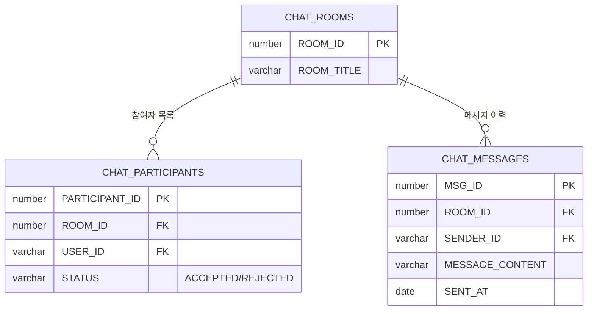
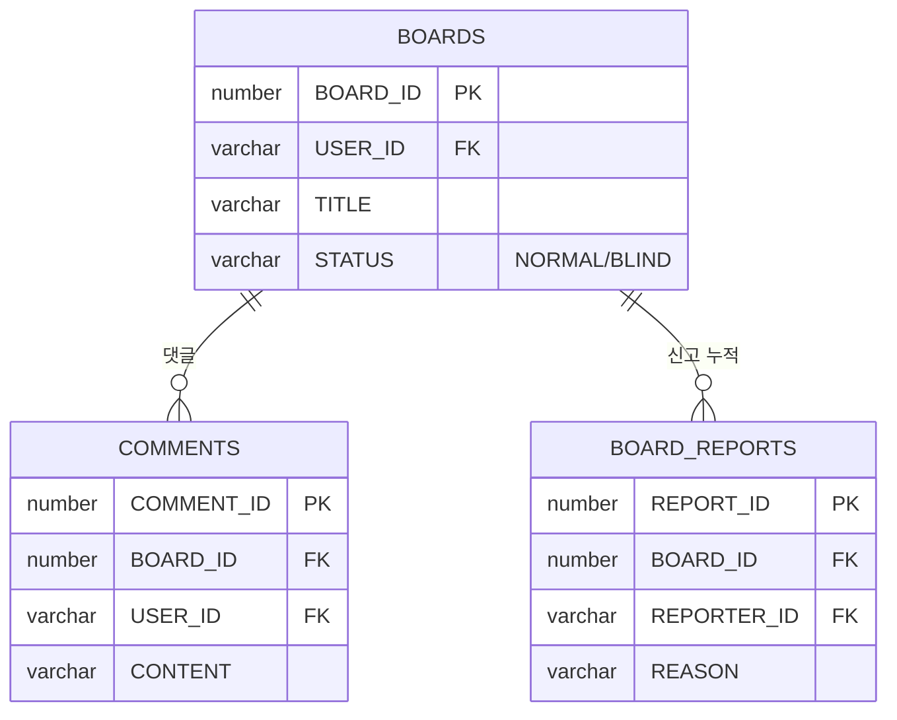

# EasyEarth 파이널 프로젝트 ERD (Entity Relationship Diagram)

> **전체 아키텍처 다이어그램 및 도메인별 상세 설계 명세 통합본**  
> 이 문서는 실시간 채팅, 탄소 정밀 계산, 게이미피케이션 시스템의 모든 데이터 구조를 실제 DB와 100% 동일하게 정의합니다.

---

## 📑 목차
1. [데이터 설계 및 정합성 유지 원칙](#-데이터-설계-및-정합성-유지-원칙-technical-note)
2. [전체 도메인 관계도 (Overview)](#1-전체-도메인-관계도-overview)
3. [도메인 계층 구조 (Hierarchy View)](#2-도메인-계층-구조-hierarchy-view)
4. [테이블 상세 명세 (Data Dictionary)](#3-테이블-상세-명세-data-dictionary)
5. [도메인별 분리 ERD (Domain Specific)](#4-도메인별-분리-erd-domain-specific)
6. [DB 성능 최적화 전략 (Index Strategy)](#5-db-성능-최적화-전략-index-strategy)

---

## 💡 데이터 설계 및 정합성 유지 원칙 (Technical Note)
- **수치 정밀도 (Precision)**: 탄소 절감량(`distance * 0.21`)과 같은 환경 수치는 데이터 손실 방지를 위해 Oracle `NUMBER(10, 3)` 타입을 적용하여 소수점 셋째 자리까지 관리합니다.
- **보안 기반 설계**: 비밀번호는 `BCrypt` 10 rounds 암호화를 필수로 하며, `Stateless(JWT)` 인증을 지원하기 위한 사용자 식별 구조를 갖춥니다.
- **거버넌스 및 자정 작용**: 신고(`BOARD_REPORTS`) 테이블과 연동하여 신고 10회 누적 시 게시글 상태를 `BLIND`로 자동 전환하는 로직을 데이터 수준에서 지원합니다.

---

## 📊 1. 전체 도메인 관계도 (Overview)

```mermaid
erDiagram
    %% ──────────────────────────
    %%  1. 회원 및 경제 생태계 (Member & Wallet)
    %% ──────────────────────────
    MEMBERS {
        varchar USER_ID PK
        varchar USER_PWD "BCrypt 암호화"
        varchar USER_NAME
        varchar USER_NICKNAME
        char    ONLINE_STATUS "Y/N 실시간 상태"
        varchar USER_ROLE "ADMIN/MEMBER"
        date    ENROLL_DATE
    }

    WALLETS {
        number  WALLET_ID PK
        varchar USER_ID FK
        number  CURRENT_POINTS
        number  TOTAL_ACCUMULATED
    }

    POINT_HISTORIES {
        number  HISTORY_ID PK
        number  WALLET_ID FK
        varchar ACTION_TYPE "QUIZ/QUEST/ATTENDANCE"
        number  AMOUNT
        date    CREATED_AT
    }

    %% ──────────────────────────
    %%  2. 실시간 채팅 (Live Chat)
    %% ──────────────────────────
    CHAT_ROOMS {
        number  ROOM_ID PK
        varchar ROOM_TITLE
        date    CREATED_AT
    }

    CHAT_PARTICIPANTS {
        number  PARTICIPANT_ID PK
        number  ROOM_ID FK
        varchar USER_ID FK
        varchar STATUS "PENDING/ACCEPTED/REJECTED"
        date    JOINED_AT
    }

    CHAT_MESSAGES {
        number  MSG_ID PK
        number  ROOM_ID FK
        varchar SENDER_ID FK
        varchar MESSAGE_CONTENT
        char    IS_DELETED "Soft Delete"
        date    SENT_AT
    }

    %% ──────────────────────────
    %%  3. 지도 및 탄소 기록 (Map & Eco)
    %% ──────────────────────────
    ECO_SHOPS {
        number  SHOP_ID PK
        varchar SHOP_NAME
        varchar CATEGORY
        varchar ADDRESS
        number  LATITUDE
        number  LONGITUDE
    }

    SHOP_REVIEWS {
        number  REVIEW_ID PK
        number  SHOP_ID FK
        varchar USER_ID FK
        varchar CONTENT
        number  RATING
    }

    MAP_RECORDS {
        number  RECORD_ID PK
        varchar USER_ID FK
        number  DISTANCE "KM 단위"
        number  CARBON_REDUCED "NUMBER(10,3)"
        date    CREATED_AT
    }

    %% ──────────────────────────
    %%  4. 커뮤니티 및 보안 (Community)
    %% ──────────────────────────
    BOARDS {
        number  BOARD_ID PK
        varchar USER_ID FK
        varchar TITLE
        varchar CONTENT
        varchar STATUS "NORMAL/BLIND"
        number  VIEW_COUNT
        date    CREATE_DATE
    }

    COMMENTS {
        number  COMMENT_ID PK
        number  BOARD_ID FK
        varchar USER_ID FK
        varchar CONTENT
        char    IS_DELETED
    }

    BOARD_REPORTS {
        number  REPORT_ID PK
        number  BOARD_ID FK
        varchar REPORTER_ID FK
        varchar REASON
        date    REPORTED_AT
    }

    %% ──────────────────────────
    %%  5. 게이미피케이션 (Gamification)
    %% ──────────────────────────
    ECO_TREES {
        number  TREE_ID PK
        varchar USER_ID FK
        number  LEVEL
        number  CURRENT_XP
    }

    QUIZZES {
        number  QUIZ_ID PK
        varchar QUESTION
        varchar ANSWER
        number  REWARD_POINT
    }

    ATTENDANCES {
        number  ATTENDANCE_ID PK
        varchar USER_ID FK
        date    ATTEND_DATE
    }

    %% ══════════════════════════
    %%  관계 정의 (Full Relationships)
    %% ══════════════════════════

    MEMBERS ||--|| WALLETS : "소유"
    WALLETS ||--o{ POINT_HISTORIES : "증감내역"
    MEMBERS ||--|| ECO_TREES : "성장"
    
    MEMBERS ||--o{ CHAT_PARTICIPANTS : "참여"
    CHAT_ROOMS ||--o{ CHAT_PARTICIPANTS : "소속"
    CHAT_ROOMS ||--o{ CHAT_MESSAGES : "포함"
    MEMBERS ||--o{ CHAT_MESSAGES : "발신"

    MEMBERS ||--o{ MAP_RECORDS : "기록"
    ECO_SHOPS ||--o{ SHOP_REVIEWS : "후기"
    MEMBERS ||--o{ SHOP_REVIEWS : "작성"

    MEMBERS ||--o{ BOARDS : "작성"
    BOARDS ||--o{ COMMENTS : "댓글"
    BOARDS ||--o{ BOARD_REPORTS : "피신고"
    MEMBERS ||--o{ BOARD_REPORTS : "신고접수"

    MEMBERS ||--o{ ATTENDANCES : "출석"
```

---

## 📊 2. 도메인 계층 구조 (Hierarchy View)
- 시스템의 데이터 의존성 및 생명주기를 고려한 계층적 설계도입니다.

---

## 📋 3. 테이블 상세 명세 (Data Dictionary)

### 🔑 주요 컬럼 제약사항
| 테이블 | 컬럼 | 타입 | 제약조건 | 설명 / 비고 |
|---|---|---|---|---|
| `MEMBERS` | `USER_PWD` | VARCHAR2(100) | NN | **BCrypt** 해시 암호화 (Stateless 권장) |
| `MEMBERS` | `ONLINE_STATUS` | CHAR(1) | DEFAULT 'N' | WebSocket 세션 연결 상태 동기화 |
| `MAP_RECORDS` | `CARBON_REDUCED`| NUMBER(10,3) | NN | 탄소 절감량 (소수점 3자리 정밀도) |
| `BOARDS` | `STATUS` | VARCHAR2(10) | DEFAULT 'NORMAL' | 신고 10회 누적 시 자동으로 `BLIND` 전환 |
| `CHAT_MESSAGES`| `IS_DELETED` | CHAR(1) | DEFAULT 'N' | 메시지 삭제 시 물리 삭제 대신 상태 변경 |
| `ECO_TREES` | `CURRENT_XP` | NUMBER | DEFAULT 0 | 획득 경험치 (레벨업 임계값 로직 연동) |

### 🏷️ 시퀀스(Sequence) 목록
| 시퀀스명 | 적용 테이블.컬럼 | 시퀀스명 | 적용 테이블.컬럼 |
|---|---|---|---|
| `SEQ_CHAT_ROOM` | CHAT_ROOMS.ROOM_ID | `SEQ_CHAT_MSG` | CHAT_MESSAGES.MSG_ID |
| `SEQ_BOARD_ID` | BOARDS.BOARD_ID | `SEQ_POINT_HIS` | POINT_HISTORIES.HISTORY_ID |
| `SEQ_MAP_REC` | MAP_RECORDS.RECORD_ID | `SEQ_SHOP_ID` | ECO_SHOPS.SHOP_ID |

---

## 🗂️ 4. 도메인별 분리 ERD (Domain Specific)

### 💰 3.1 Eco-Wallet & Economic System
> 사용자의 모든 활동 보상을 정밀하게 추적하고 관리합니다.

### 💬 3.2 Real-time Messaging (STOMP)
> WebSocket 세션과 STOMP 브로드캐스팅을 위한 메시지 구조입니다.

### 📝 3.3 Community & Self-Moderation
> 게시판과 신고 시스템을 연동한 커뮤니티 거버넌스 구조입니다.

---

## ⚡ 5. DB 성능 최적화 전략 (Index Strategy)

| 분류 | 대상 테이블 | 대상 컬럼 | 기대 효과 |
|---|---|---|---|
| **채팅 페이징** | `CHAT_MESSAGES` | `ROOM_ID, SENT_AT` | 특정 방의 메시지 최신순 조회 가속 |
| **지도 공간 검색** | `ECO_SHOPS` | `LATITUDE, LONGITUDE` | 현재 위치 기반 주변 상점 검색 최적화 |
| **포인트 정산** | `POINT_HISTORIES`| `WALLET_ID, CREATED_AT` | 월별/활동별 리포트 산출 성능 향상 |
