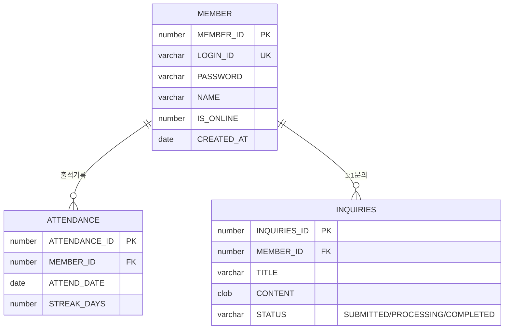
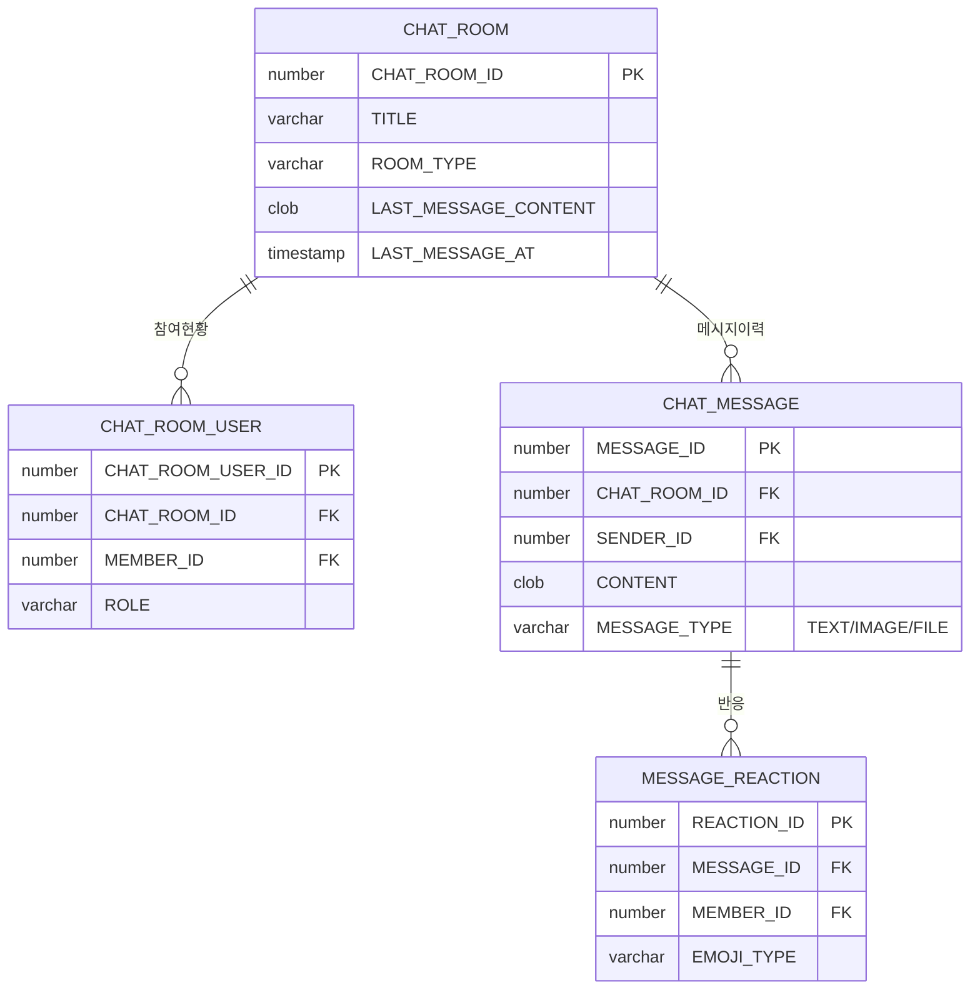
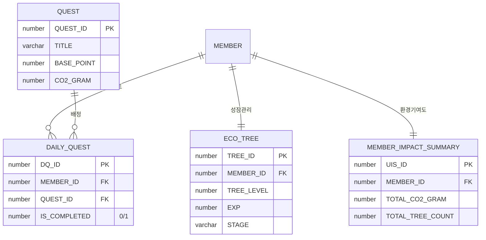
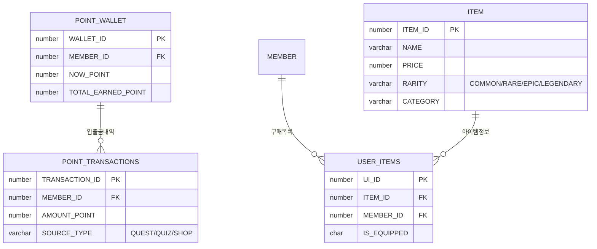

# 🗄️ EasyEarth 물리 데이터 모델링 명세 (ERD Specification)

> **탄소 중립 실천 및 게이미피케이션 시스템을 위한 물리 DB 설계 전략**  
> 이 문서는 실시간 채팅, AI 환경 일기, 탄소 발자국 정밀 계산 시스템의 모든 테이블(31개)과 상세 제약조건을 실제 DB 구현체와 100% 동일하게 정의하며, 데이터 정합성을 위한 논리/물리 설계 근거를 명세합니다.

---

## 📑 목차
1. [데이터 설계 및 정합성 유지 원칙](#-데이터-설계-및-정합성-유지-원칙-technical-note)
2. [전체 도메인 관계도 (Overview)](#1-전체-도메인-관계도-overview)
3. [도메인 계층 구조 (Hierarchy View)](#2-도메인-계층-구조-hierarchy-view)
4. [테이블 상세 명세 (Data Dictionary)](#3-테이블-상세-명세-data-dictionary)
5. [도메인별 분리 ERD (Domain Specific)](#4-도메인별-분리-erd-domain-specific)
6. [DB 성능 및 최적화 전략 (Index & Strategy)](#5-db-성능-및-최적화-전략-index--strategy)

---

## 💡 데이터 설계 및 정합성 유지 원칙 (Technical Note)
- **수치 정밀도 (Precision)**: 탄소 절감량(`CO2_GRAM`) 등 환경 수치는 데이터 손실 방지를 위해 Oracle `NUMBER(10, 2)` 타입을 적용하여 정밀하게 관리합니다.
- **트리거 기반 자동화**: 회원가입 시 지갑(`POINT_WALLET`) 자동 생성, 리뷰 작성 시 상점 평점(`AVG_RATING`) 자동 갱신 등을 DB 트리거 레벨에서 처리하여 비즈니스 로직의 일관성을 확보했습니다.
- **Soft Delete & Status**: 커뮤니티 게시글 및 댓글은 데이터 이력 보존을 위해 `STATUS` 컬럼('Y', 'N', 'B')을 활용한 논리 삭제 방식을 채택했습니다.
- **실시간성 대응**: 채팅방의 마지막 메시지 정보(`LAST_MESSAGE_CONTENT`, `LAST_MESSAGE_AT`)를 부모 테이블에 반정규화하여 리스트 조회 성능을 최적화했습니다.

---

## 📊 1. 전체 도메인 관계도 (Overview)

```mermaid
erDiagram
    %% ──────────────────────────
    %%  1. 회원 및 보안 (Identity)
    %% ──────────────────────────
    MEMBER {
        number  MEMBER_ID PK
        varchar LOGIN_ID UK
        varchar PASSWORD
        varchar NAME
        number  IS_ONLINE "0/1"
        number  TOTAL_POINTS
        date    CREATED_AT
    }

    %% ──────────────────────────
    %%  2. 경제 및 아이템 (Economy)
    %% ──────────────────────────
    POINT_WALLET {
        number  WALLET_ID PK
        number  MEMBER_ID FK
        number  NOW_POINT
        number  TOTAL_EARNED_POINT
    }

    ITEM {
        number  ITEM_ID PK
        varchar NAME
        number  PRICE
        varchar RARITY
        varchar CATEGORY "BADGE/BG/TITLE"
    }

    USER_ITEMS {
        number  UI_ID PK
        number  ITEM_ID FK
        number  MEMBER_ID FK
        char    IS_EQUIPPED "Y/N"
    }

    %% ──────────────────────────
    %%  3. 환경 활동 및 AI (Activity & AI)
    %% ──────────────────────────
    ECO_DIARY {
        number  DIARY_ID PK
        number  MEMBER_ID FK
        varchar TITLE
        clob    CONTENT
        date    CREATED_AT
    }

    ECO_DIARY_AI_REPLY {
        number  EDAR_ID PK
        number  DIARY_ID FK
        clob    CONTENT
    }

    ECO_TREE {
        number  TREE_ID PK
        number  MEMBER_ID FK
        number  TREE_LEVEL
        number  EXP
    }

    %% ──────────────────────────
    %%  4. 정보 및 지도 (Map & Info)
    %% ──────────────────────────
    ECO_SHOP {
        number  SHOP_ID PK
        varchar NAME
        varchar ADDRESS
        number  LAT
        number  LNG
        number  AVG_RATING
    }

    ECO_SHOP_REVIEW {
        number  ESR_ID PK
        number  SHOP_ID FK
        number  MEMBER_ID FK
        number  RATING
        clob    CONTENT
    }

    %% ──────────────────────────
    %%  5. 실시간 채팅 (Real-time Messaging)
    %% ──────────────────────────
    CHAT_ROOM {
        number  CHAT_ROOM_ID PK
        varchar TITLE
        varchar ROOM_TYPE "SINGLE/GROUP"
        clob    LAST_MESSAGE_CONTENT
    }

    CHAT_ROOM_USER {
        number  CHAT_ROOM_USER_ID PK
        number  CHAT_ROOM_ID FK
        number  MEMBER_ID FK
        varchar ROLE "OWNER/MEMBER"
    }

    CHAT_MESSAGE {
        number  MESSAGE_ID PK
        number  CHAT_ROOM_ID FK
        number  SENDER_ID FK
        clob    CONTENT
        varchar MESSAGE_TYPE
    }

    %% ──────────────────────────
    %%  6. 커뮤니티 및 거버넌스 (Community)
    %% ──────────────────────────
    COMMUNITY_POST {
        number  POST_ID PK
        number  MEMBER_ID FK
        varchar TITLE
        varchar STATUS "Y/N/B"
        number  REPORT_COUNT
    }

    REPORTS {
        number  REPORTS_ID PK
        number  MEMBER_ID FK "신고자"
        number  TARGET_MEMBER_ID FK "피신고자"
        varchar TYPE "POST/REPLY/REVIEW"
        varchar REASON
    }

    %% ══════════════════════════
    %%  관계 정의 (Full Logical)
    %% ══════════════════════════

    MEMBER ||--|| POINT_WALLET : "지갑소유"
    MEMBER ||--o{ USER_ITEMS : "보유"
    ITEM ||--o{ USER_ITEMS : "등록됨"
    
    MEMBER ||--o{ ECO_DIARY : "작성"
    ECO_DIARY ||--|| ECO_DIARY_AI_REPLY : "AI응답"
    MEMBER ||--|| ECO_TREE : "육성"

    ECO_SHOP ||--o{ ECO_SHOP_REVIEW : "포함"
    MEMBER ||--o{ ECO_SHOP_REVIEW : "작성"

    CHAT_ROOM ||--o{ CHAT_ROOM_USER : "참여"
    MEMBER ||--o{ CHAT_ROOM_USER : "소속"
    CHAT_ROOM ||--o{ CHAT_MESSAGE : "기록"
    MEMBER ||--o{ CHAT_MESSAGE : "발신"

    MEMBER ||--o{ COMMUNITY_POST : "작성"
    COMMUNITY_POST ||--o{ REPORTS : "피신고"
    MEMBER ||--o{ REPORTS : "신고접수"
```



---

## 🔄 2. 도메인 계층 구조 (Hierarchy View)

```text
MEMBER (MEMBER_ID)
  ├── POINT_WALLET (MEMBER_ID)
  │     └── POINT_TRANSACTIONS (MEMBER_ID)
  ├── ECO_TREE (MEMBER_ID)
  ├── ECO_DIARY (MEMBER_ID)
  │     └── ECO_DIARY_AI_REPLY (DIARY_ID)
  ├── USER_ITEMS (MEMBER_ID) ← ITEM (ITEM_ID)
  ├── CHAT_ROOM_USER (MEMBER_ID) ← CHAT_ROOM (CHAT_ROOM_ID)
  │     └── CHAT_MESSAGE (CHAT_ROOM_ID)
  │           └── MESSAGE_REACTION (MESSAGE_ID)
  ├── COMMUNITY_POST (MEMBER_ID)
  │     ├── POST_FILES (POST_ID)
  │     ├── COMMUNITY_REPLY (POST_ID)
  │     ├── COMMUNITY_POST_LIKES (POST_ID)
  │     └── REPORTS (POST_ID)
  ├── ATTENDANCE (MEMBER_ID)
  ├── DAILY_QUEST (MEMBER_ID) ← QUEST (QUEST_ID)
  ├── INQUIRIES (MEMBER_ID)
  └── ECO_SHOP_REVIEW (MEMBER_ID) ← ECO_SHOP (SHOP_ID)
        ├── ECO_SHOP_SUGGESTION (SHOP_ID)
        └── ROUTE_COMPARE (SHOP_ID)
```

---

## 📋 3. 테이블 상세 명세 (Data Dictionary)

### 🔑 주요 컬럼 제약사항
| 테이블 | 컬럼 | 타입 | 제약조건 | 설명 / 비고 |
|---|---|---|---|---|
| `MEMBER` | `PASSWORD` | VARCHAR2(100) | NN | **BCrypt** 해시 암호화 (Stateless/JWT 필수) |
| `MEMBER` | `IS_ONLINE` | NUMBER(1) | DEFAULT 0 | WebSocket 접속 상태 (0:오프라인, 1:온라인) |
| `ECO_SHOP` | `AVG_RATING` | NUMBER(3,2) | DEFAULT 0 | 상점 평균 별점 (리뷰 작성 시 트리거 갱신) |
| `QUEST` | `CO2_GRAM` | NUMBER(10) | DEFAULT 0 | 퀘스트 완료 시 절감되는 탄소량(g) |
| `CHAT_ROOM` | `ROOM_TYPE` | VARCHAR2(20) | NN | `SINGLE`(1:1), `GROUP`(다대다) 구분 |
| `COMMUNITY_POST`| `STATUS` | VARCHAR2(1) | DEFAULT 'Y' | `Y`(정상), `N`(삭제), `B`(블라인드) |
| `REPORTS` | `TYPE` | VARCHAR2(20) | NN | `POST`, `REPLY`, `REVIEW` 중 하나 필수 |

### 🏷️ 시퀀스(Sequence) 목록
| 시퀀스명 | 적용 테이블.컬럼 | 시퀀스명 | 적용 테이블.컬럼 |
|---|---|---|---|
| `MEMBER_SEQ` | MEMBER.MEMBER_ID | `SEQ_WALLET_ID` | POINT_WALLET.WALLET_ID |
| `POST_ID_SEQ` | COMMUNITY_POST.POST_ID | `REPLY_ID_SEQ` | COMMUNITY_REPLY.REPLY_ID |
| `SEQ_ITEM_ID` | ITEM.ITEM_ID | `SEQ_SHOP_ID` | ECO_SHOP.SHOP_ID |
| `REPORTS_ID_SEQ`| REPORTS.REPORTS_ID | `SEQ_ATTENDANCE_ID`| ATTENDANCE.ATTENDANCE_ID |

---

## 🗂️ 4. 도메인별 분리 ERD (Domain Specific)

### 👤 4.1 회원 및 인증 도메인 (Identity & Security)


### 💬 4.2 실시간 채팅 도메인 (Real-time Messaging)


### 🌱 4.3 게이미피케이션 도메인 (Gamification & Carbon)


### 💰 4.4 에코 경제 도메인 (Eco-Economy)


---

## ⚡ 5. DB 성능 및 최적화 전략 (Index & Strategy)

### 5.1 인덱스 설계 (Indexing)
- **복합 인덱스 (`IDX_ROOM_MEMBER_COMP`)**: `CHAT_ROOM_USER` 테이블의 `CHAT_ROOM_ID`와 `MEMBER_ID`에 복합 인덱스를 적용하여 특정 사용자가 속한 채팅방 검색 및 중복 참여 방지 성능을 극대화했습니다.
- **시계열 인덱스**: `CHAT_MESSAGE.CREATED_AT` 및 `COMMUNITY_POST.CREATED_AT`에 인덱스를 고려하여 최신 데이터 페이징 성능을 확보했습니다.

### 5.2 정합성 및 자동화 (Integrity & Automation)
- **트리거(`TRG_MEMBER_REGISTERED`)**: 신규 회원 가입 시 `POINT_WALLET` 및 기본 포인트를 자동으로 생성하여 애플리케이션 계층의 부담을 줄이고 데이터 누락을 방지합니다.
- **자율 트랜잭션(`PRAGMA AUTONOMOUS_TRANSACTION`)**: 리뷰 작성 시 상점의 평균 평점을 계산하는 트리거(`TRG_UPDATE_AVG_RATING`)를 독립 트랜잭션으로 처리하여, 메인 트랜잭션(리뷰 저장)의 성능 저하 없이 정확한 수치를 유지합니다.

### 5.3 저장 구조 최적화 (Storage Optimization)
- **CLOB 타입 활용**: 채팅 내용, 게시글 본문, AI 응답 등 대용량 텍스트 데이터는 `CLOB` 타입을 사용하여 데이터 크기 제한 문제를 해결했습니다.
- **반정규화 전략**: 채팅방 테이블(`CHAT_ROOM`)에 마지막 메시지 정보를 보관하여, 채팅 목록 조회 시 수만 건의 메시지 테이블을 조인하지 않고도 실시간 프리뷰를 제공할 수 있도록 설계했습니다.

---

### 💡 설계 결정 근거 (Design Rationale)
- **Oracle Sequence**: 모든 PK에 시퀀스를 적용하여 분산 환경에서도 충돌 없는 고유성을 보장합니다.
- **Check Constraints**: `IS_ONLINE (0,1)`, `STATUS (Y,N,B)` 등 도메인 범위를 DB 수준에서 강제하여 잘못된 데이터 삽입을 원천 차단했습니다.
- **Relational Integrity**: `ON DELETE CASCADE`를 적재적소에 배치하여 회원 탈퇴 시 연관된 개인 정보(일기, 지갑 등)가 완벽히 정제되도록 설계했습니다.
