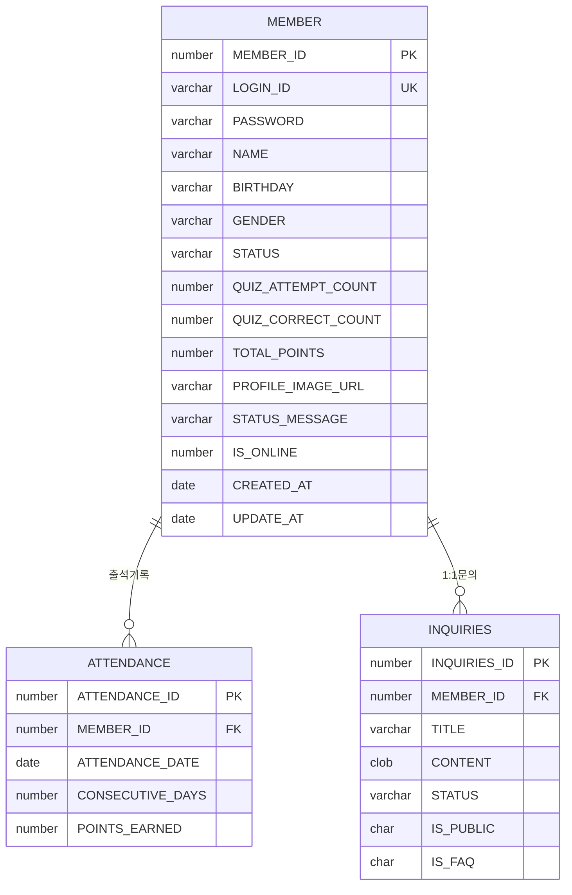
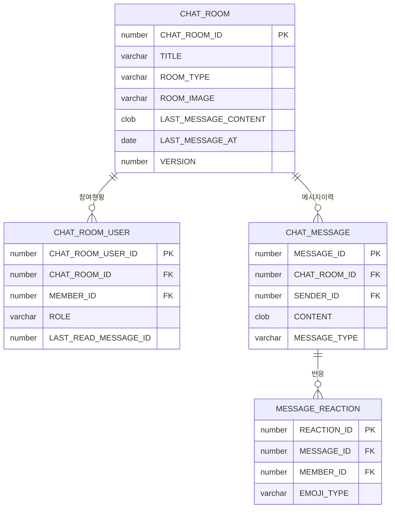
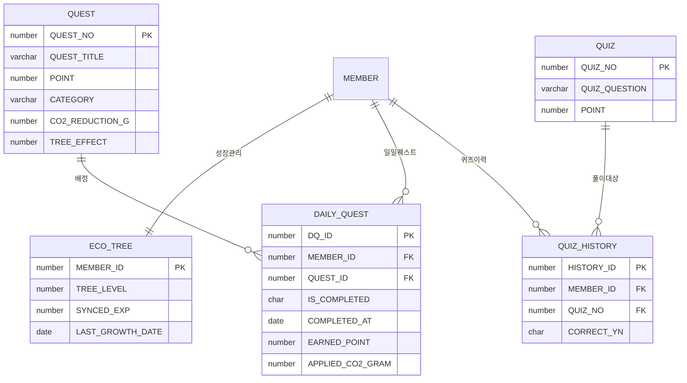
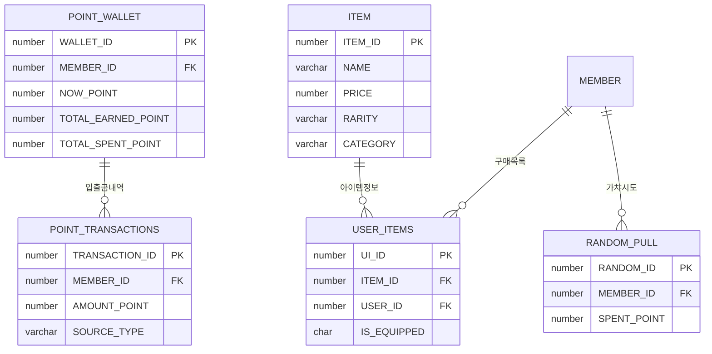
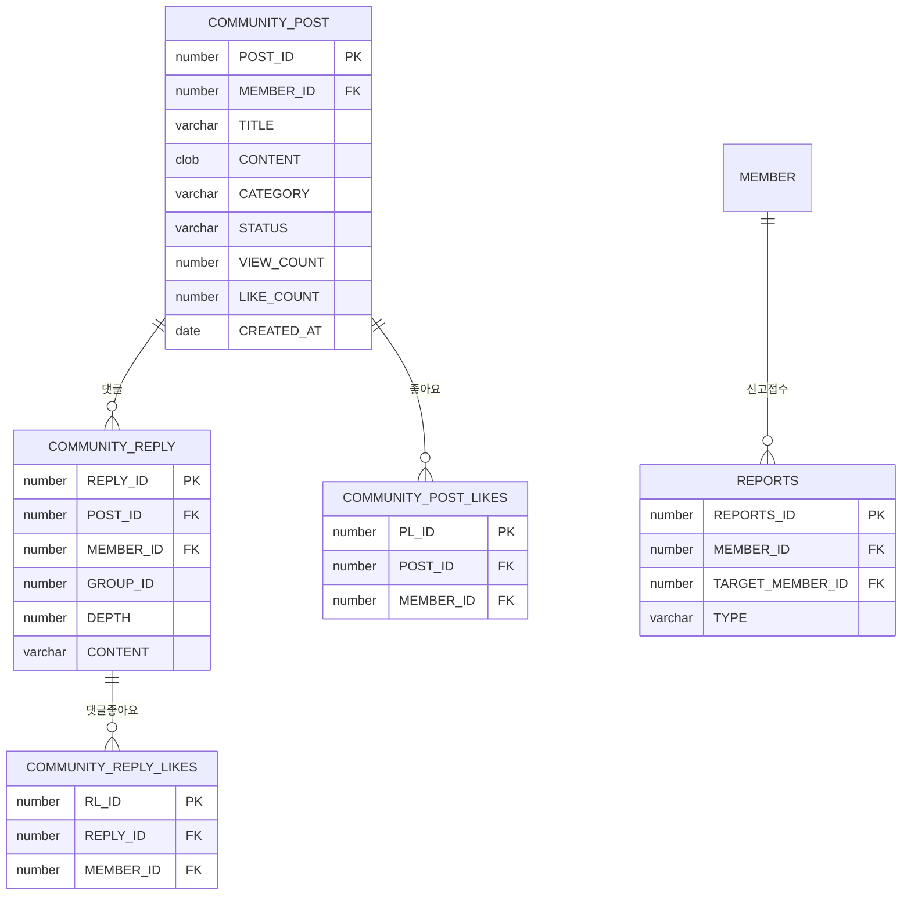
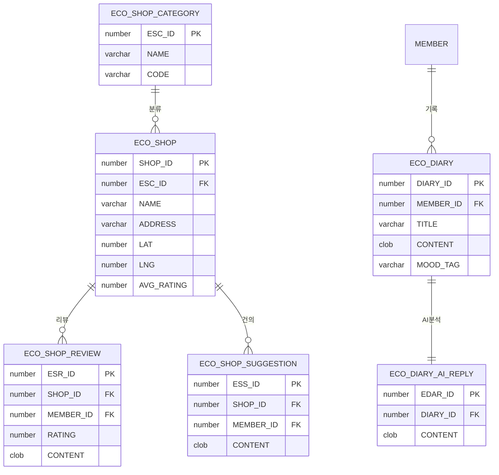

# 🗄️ EasyEarth 물리 데이터 모델링 명세 (ERD Specification)

> **탄소 중립 실천 및 게이미피케이션 시스템을 위한 물리 DB 설계 전략**  
> 이 문서는 실시간 채팅, AI 환경 일기, 탄소 발자국 정밀 계산 시스템의 모든 테이블(33개)과 상세 제약조건을 실제 DB 구현체(`init_db.sql`)와 100% 동일하게 정의하며, 데이터 정합성을 위한 논리/물리 설계 근거를 명세합니다.

---

## 📑 목차
1. [데이터 설계 및 정합성 유지 원칙](#-데이터-설계-및-정합성-유지-원칙-technical-note)
2. [전체 도메인 관계도 (Overview)](#1-전체-도메인-관계도-overview)
3. [도메인 계층 구조 (Hierarchy View)](#2-도메인-계층-구조-hierarchy-view)
4. [테이블 상세 명세 (Data Dictionary)](#3-테이블-상세-명세-data-dictionary)
5. [도메인별 분리 ERD (Domain Specific)](#4-도메인별-분리-erd-domain-specific)
6. [DB 성능 및 최적화 전략 (Performance Optimization)](#5-db-성능-및-최적화-전략-performance-optimization)

---

## 💡 데이터 설계 및 정합성 유지 원칙 (Technical Note)
- **수치 정밀도 (Precision)**: 탄소 절감량(`CO2_GRAM`) 등 환경 수치는 데이터 손실 방지를 위해 Oracle `NUMBER(10, 2)` 타입을 적용하여 정밀하게 관리합니다.
- **트리거 기반 자동화**: 회원가입 시 지갑(`POINT_WALLET`) 및 나무(`ECO_TREE`) 자동 생성, 리뷰 작성 시 상점 평점(`AVG_RATING`) 자동 갱신 등을 DB 트리거 레벨에서 처리하여 비즈니스 로직의 일관성을 확보했습니다.
- **Soft Delete & Status**: 커뮤니티 게시글 및 댓글은 데이터 이력 보존을 위해 `STATUS` 컬럼('Y', 'N', 'B')을 활용한 논리 삭제 방식을 채택했습니다.
- **실시간성 대응**: 채팅방의 마지막 메시지 정보(`LAST_MESSAGE_CONTENT`, `LAST_MESSAGE_AT`)를 부모 테이블에 반정규화하여 리스트 조회 성능을 최적화했습니다.
- **낙관적 락 (Optimistic Locking)**: `CHAT_ROOM`의 `VERSION` 컬럼을 통해 다수의 사용자가 동시에 채팅방 정보를 수정할 때 발생할 수 있는 데이터 충돌을 방지합니다.

---

## 📊 1. 전체 도메인 관계도 (Overview)

```mermaid
erDiagram
    %% ──────────────────────────
    %%  1. 회원 및 보안 (Identity)
    %% ──────────────────────────
    MEMBER {
        number  MEMBER_ID PK
        varchar LOGIN_ID UK
        varchar PASSWORD
        varchar NAME
        varchar BIRTHDAY
        varchar GENDER
        varchar STATUS "Y/N/B"
        number  QUIZ_ATTEMPT_COUNT
        number  QUIZ_CORRECT_COUNT
        number  TOTAL_POINTS
        varchar PROFILE_IMAGE_URL
        varchar STATUS_MESSAGE
        number  IS_ONLINE "0/1"
        date    CREATED_AT
        date    UPDATE_AT
    }
    ATTENDANCE {
        number ATTENDANCE_ID PK
        number USER_ID FK
        date   ATTENDANCE_DATE
        number CONSECUTIVE_DAYS
        number POINTS_EARNED
    }
    INQUIRIES {
        number INQUIRIES_ID PK
        number MEMBER_ID FK
        varchar TITLE
        clob    CONTENT
        varchar STATUS
        char    IS_PUBLIC
        char    IS_FAQ
    }

    %% ──────────────────────────
    %%  2. 경제 및 아이템 (Economy)
    %% ──────────────────────────
    POINT_WALLET {
        number  WALLET_ID PK
        number  MEMBER_ID FK
        number  NOW_POINT
        number  TOTAL_EARNED_POINT
        number  TOTAL_SPENT_POINT
    }
    ITEM {
        number  ITEM_ID PK
        varchar NAME
        number  PRICE
        varchar RARITY
        varchar CATEGORY
    }
    USER_ITEMS {
        number  UI_ID PK
        number  ITEM_ID FK
        number  USER_ID FK
        char    IS_EQUIPPED "Y/N"
    }

    %% ──────────────────────────
    %%  3. 환경 활동 및 AI (Activity & AI)
    %% ──────────────────────────
    ECO_DIARY {
        number  DIARY_ID PK
        number  MEMBER_ID FK
        varchar TITLE
        clob    CONTENT
        varchar MOOD_TAG
        date    CREATED_AT
    }
    ECO_DIARY_AI_REPLY {
        number  EDAR_ID PK
        number  DIARY_ID FK
        clob    CONTENT
    }
    ECO_TREE {
        number  MEMBER_ID PK,FK
        number  TREE_LEVEL
        number  SYNCED_EXP
        date    LAST_GROWTH_DATE
    }
    DAILY_QUEST {
        number DQ_ID PK
        number MEMBER_ID FK
        number QUEST_ID FK
        char   IS_COMPLETED
        date   COMPLETED_AT
        number EARNED_POINT
        number APPLIED_CO2_GRAM
    }

    %% ──────────────────────────
    %%  4. 정보 및 지도 (Map & Info)
    %% ──────────────────────────
    ECO_SHOP {
        number  SHOP_ID PK
        number  ESC_ID FK
        varchar NAME
        varchar ADDRESS
        number  LAT
        number  LNG
        number  AVG_RATING
    }
    ECO_SHOP_REVIEW {
        number  ESR_ID PK
        number  SHOP_ID FK
        number  MEMBER_ID FK
        number  RATING
        clob    CONTENT
    }

    %% ──────────────────────────
    %%  5. 실시간 채팅 (Real-time Messaging)
    %% ──────────────────────────
    CHAT_ROOM {
        number  CHAT_ROOM_ID PK
        varchar TITLE
        varchar ROOM_TYPE
        clob    LAST_MESSAGE_CONTENT
        date    LAST_MESSAGE_AT
        number  VERSION
    }
    CHAT_ROOM_USER {
        number  CHAT_ROOM_USER_ID PK
        number  CHAT_ROOM_ID FK
        number  MEMBER_ID FK
        varchar ROLE
        number  LAST_READ_MESSAGE_ID
    }
    CHAT_MESSAGE {
        number  MESSAGE_ID PK
        number  CHAT_ROOM_ID FK
        number  SENDER_ID FK
        clob    CONTENT
        varchar MESSAGE_TYPE
    }

    %% ──────────────────────────
    %%  6. 커뮤니티 (Community)
    %% ──────────────────────────
    COMMUNITY_POST {
        number  POST_ID PK
        number  MEMBER_ID FK
        varchar TITLE
        clob    CONTENT
        varchar CATEGORY
        varchar STATUS
        number  VIEW_COUNT
        number  LIKE_COUNT
        date    CREATED_AT
    }
    COMMUNITY_REPLY {
        number  REPLY_ID PK
        number  POST_ID FK
        number  MEMBER_ID FK
        number  GROUP_ID
        number  DEPTH
        varchar CONTENT
    }

    %% ──────────────────────────
    %%  7. 통계 및 로그 (Stats & History)
    %% ──────────────────────────
    MEMBER_IMPACT_SUMMARY {
        number UIS_ID PK
        number MEMBER_ID FK
        number TOTAL_CO2_GRAM
        number TOTAL_TREE_COUNT
    }
    INTEGRATED_HISTORY {
        number HISTORY_ID PK
        number MEMBER_ID FK
        varchar ACTIVITY_TYPE
        number REF_ID
        char   STATUS
        varchar IMAGE_URL
    }

    %% ══════════════════════════
    %%  관계 정의
    %% ══════════════════════════
    MEMBER ||--|| POINT_WALLET : "지갑소유"
    MEMBER ||--|| ECO_TREE : "나무육성"
    MEMBER ||--o{ DAILY_QUEST : "수행"
    MEMBER ||--o{ ECO_DIARY : "기록"
    ECO_DIARY ||--|| ECO_DIARY_AI_REPLY : "AI분석"
    
    MEMBER ||--o{ CHAT_ROOM_USER : "참여"
    CHAT_ROOM ||--o{ CHAT_ROOM_USER : "포함"
    CHAT_ROOM ||--o{ CHAT_MESSAGE : "메시지"
    
    MEMBER ||--o{ COMMUNITY_POST : "작성"
    COMMUNITY_POST ||--o{ COMMUNITY_REPLY : "댓글"
    
    MEMBER ||--|| MEMBER_IMPACT_SUMMARY : "영향력통계"
    MEMBER ||--o{ INTEGRATED_HISTORY : "전체로그"
```



---

## 🔄 2. 도메인 계층 구조 (Hierarchy View)

```text
MEMBER (MEMBER_ID)
  ├── POINT_WALLET (MEMBER_ID)
  │     └── POINT_TRANSACTIONS (MEMBER_ID)
  ├── ECO_TREE (MEMBER_ID)
  ├── ECO_DIARY (MEMBER_ID)
  │     └── ECO_DIARY_AI_REPLY (DIARY_ID)
  ├── USER_ITEMS (MEMBER_ID) ← ITEM (ITEM_ID)
  ├── CHAT_ROOM_USER (MEMBER_ID) ← CHAT_ROOM (CHAT_ROOM_ID)
  │     └── CHAT_MESSAGE (CHAT_ROOM_ID)
  │           └── MESSAGE_REACTION (MESSAGE_ID)
  ├── COMMUNITY_POST (MEMBER_ID)
  │     ├── POST_FILES (POST_ID)
  │     ├── COMMUNITY_REPLY (POST_ID)
  │     │     └── COMMUNITY_REPLY_LIKES (REPLY_ID)
  │     ├── COMMUNITY_POST_LIKES (POST_ID)
  │     └── REPORTS (POST_ID)
  ├── ATTENDANCE (MEMBER_ID)
  ├── DAILY_QUEST (MEMBER_ID) ← QUEST (QUEST_ID)
  ├── QUIZ_HISTORY (MEMBER_ID) ← QUIZ (QUIZ_NO)
  ├── INTEGRATED_HISTORY (MEMBER_ID)
  ├── MEMBER_IMPACT_SUMMARY (MEMBER_ID)
  │     └── IMPACT_GLOBAL_DAILY (UIS_ID)
  ├── INQUIRIES (MEMBER_ID)
  └── ECO_SHOP_REVIEW (MEMBER_ID) ← ECO_SHOP (SHOP_ID)
        ├── ECO_SHOP_SUGGESTION (SHOP_ID)
        └── ROUTE_COMPARE (SHOP_ID)
```

---

## 📋 3. 테이블 상세 명세 (Data Dictionary)

본 섹션은 `EasyEarth` 시스템의 데이터 정합성과 성능 최적화를 위해 설계된 **33개 전체 테이블**의 물리적 명세를 실제 `init_db.sql` 스크립트와 1:1로 동기화하여 기술합니다.

### 🔑 3.1 회원 및 보안 (Identity & Security)
| 테이블 | 컬럼명 | 데이터 타입 | 제약조건 | 기술적 설계 의도 및 비고 |
|---|---|---|---|---|
| **MEMBER** | `MEMBER_ID` | NUMBER | PK | 내부 식별용 고유 번호 (IDENTITY) |
| | `LOGIN_ID` | VARCHAR2(50) | UK, NN | 사용자 로그인 아이디 |
| | `PASSWORD` | VARCHAR2(100) | NN | **BCrypt** 암호화 비밀번호 |
| | `NAME` | VARCHAR2(30) | NN | 사용자 실명 |
| | `BIRTHDAY` / `GENDER`| VARCHAR2 | - | 생년월일 및 성별 정보 |
| | `STATUS` | VARCHAR2(20) | - | 회원 상태 (Y:정상, N:탈퇴, B:차단) |
| | `QUIZ_ATTEMPT_COUNT`| NUMBER | DEF 0 | 퀴즈 시도 횟수 통계 |
| | `QUIZ_CORRECT_COUNT`| NUMBER | DEF 0 | 퀴즈 정답 횟수 통계 |
| | `TOTAL_POINTS` | NUMBER | DEF 0 | 현재 보유 포인트 요약 (반정규화) |
| | `PROFILE_IMAGE_URL` | VARCHAR2(500)| - | 프로필 이미지 경로 |
| | `STATUS_MESSAGE` | VARCHAR2(300)| - | 사용자 상태 메시지 |
| | `IS_ONLINE` | NUMBER(1) | DEF 0 | WebSocket 실시간 접속 여부 (0/1) |
| | `CREATED_AT` | DATE | DEF SYS | 가입 일자 |
| | `UPDATE_AT` | DATE | DEF SYS | 정보 수정 일자 |
| **ATTENDANCE** | `ATTENDANCE_ID` | NUMBER | PK | 출석 기록 고유 번호 |
| | `USER_ID` | NUMBER | FK | 회원 참조 (MEMBER_ID) |
| | `ATTENDANCE_DATE` | DATE | DEF SYS | 출석 날짜 |
| | `CONSECUTIVE_DAYS`| NUMBER | DEF 1 | 연속 출석 일수 |
| | `POINTS_EARNED` | NUMBER | DEF 0 | 출석 보상 포인트 |
| **INQUIRIES** | `INQUIRIES_ID` | NUMBER | PK | 문의 고유 번호 |
| | `MEMBER_ID` | NUMBER | FK | 작성자 |
| | `TITLE` / `CONTENT`| VARCHAR2 / CLOB| NN | 문의 제목 및 본문 |
| | `STATUS` | VARCHAR2(50) | CHECK | `SUBMITTED`, `PROCESSING`, `COMPLETED` |
| | `IS_PUBLIC` / `IS_FAQ`| CHAR(1) | DEF 'N' | 공개 여부 및 FAQ 등록 여부 |

### 🌱 3.2 게이미피케이션 및 성장 (Gamification)
| 테이블 | 컬럼명 | 데이터 타입 | 제약조건 | 기술적 설계 의도 및 비고 |
|---|---|---|---|---|
| **QUEST** | `QUEST_NO` | NUMBER | PK | 퀘스트 고유 번호 |
| | `QUEST_TITLE` | VARCHAR2(300)| NN | 퀘스트 명칭 |
| | `POINT` | NUMBER | DEF 0 | 완료 보상 포인트 |
| | `CATEGORY` | VARCHAR2(50) | - | `생활`, `교통`, `분리수거` 등 |
| | `CO2_REDUCTION_G` | NUMBER | DEF 0 | 실제 탄소 절감량 (g) |
| | `TREE_EFFECT` | NUMBER(10,4)| DEF 0 | 나무 식재 기여 수치 |
| **DAILY_QUEST**| `DQ_ID` | NUMBER | PK | 일일 퀘스트 배정 번호 |
| | `MEMBER_ID` | NUMBER | FK | 수행 회원 |
| | `QUEST_ID` | NUMBER | FK | 퀘스트 참조 |
| | `IS_COMPLETED` | CHAR(1) | DEF 'N' | 완료 여부 (Y/N) |
| | `COMPLETED_AT` | DATE | - | 완료 일시 |
| | `EARNED_POINT` | NUMBER | - | 실제 획득 포인트 |
| **QUIZ** | `QUIZ_NO` | NUMBER | PK | 퀴즈 고유 번호 |
| | `QUIZ_QUESTION` | VARCHAR2(1000)| NN | 퀴즈 질문 내용 |
| | `OPTION1`~`OPTION4` | VARCHAR2 | NN | 4지선다 선택지 |
| | `QUIZ_ANSWER` | NUMBER | NN | 정답 번호 (1~4) |
| | `QUIZ_EXPLANATION`| VARCHAR2(2000)| - | 정답 해설 및 환경 교육 정보 |
| **QUIZ_HISTORY** | `HISTORY_ID` | NUMBER | PK | 퀴즈 풀이 이력 |
| | `MEMBER_ID` | NUMBER | FK | 풀이 회원 |
| | `QUIZ_NO` | NUMBER | FK | 퀴즈 참조 |
| | `CORRECT_YN` | CHAR(1) | CHECK | 정답 여부 (Y/N) |
| **ECO_TREE** | `MEMBER_ID` | NUMBER | PK, FK | 회원당 1개의 나무 (1:1 매칭) |
| | `TREE_LEVEL` | NUMBER | DEF 1 | 성장 단계 (1:새싹 ~ 4:열매) |
| | `SYNCED_EXP` | NUMBER | NN | 성장에 반영된 누적 경험치 |
| | `LAST_GROWTH_DATE`| DATE | DEF SYS | 마지막 성장 갱신일 |
| **INTEGRATED_HISTORY**| `HISTORY_ID`| NUMBER | PK | 통합 활동 로그 (퀘스트, 퀴즈 통합) |
| | `ACTIVITY_TYPE`| VARCHAR2(20) | NN | `QUEST`, `QUIZ_E`, `QUIZ_N`, `QUIZ_H` |
| | `REF_ID` | NUMBER | NN | 원본 활동 ID (QuestNo 등) |
| | `IMAGE_URL` | VARCHAR2(500)| - | 활동 인증 사진 경로 |
| | `STATUS` | CHAR(1) | DEF 'P' | `P`(진행), `Y`(완료), `N`(실패) |

### 💬 3.3 실시간 채팅 및 반응 (Real-time Messaging)
| 테이블 | 컬럼명 | 데이터 타입 | 제약조건 | 기술적 설계 의도 및 비고 |
|---|---|---|---|---|
| **CHAT_ROOM** | `CHAT_ROOM_ID` | NUMBER | PK | 채팅방 고유 번호 |
| | `TITLE` | VARCHAR2(100)| - | 채팅방 이름 |
| | `ROOM_TYPE` | VARCHAR2(20) | CHECK | `SINGLE`, `GROUP` |
| | `ROOM_IMAGE` | VARCHAR2(255)| - | 채팅방 프로필 이미지 |
| | `LAST_MESSAGE_CONTENT`| CLOB | - | 마지막 메시지 (목록 최적화용) |
| | `LAST_MESSAGE_AT`| DATE | - | 마지막 메시지 발신 시간 |
| | `VERSION` | NUMBER | DEF 0 | **낙관적 락(Optimistic Lock)** |
| **CHAT_ROOM_USER**| `CHAT_ROOM_USER_ID`| NUMBER | PK | 참여 식별 번호 |
| | `CHAT_ROOM_ID` | NUMBER | FK | 채팅방 참조 |
| | `MEMBER_ID` | NUMBER | FK | 회원 참조 |
| | `ROLE` | VARCHAR2(20) | CHECK | `OWNER`, `ADMIN`, `MEMBER` |
| | `LAST_READ_MESSAGE_ID`| NUMBER | - | 안 읽은 메시지 계산용 |
| **CHAT_MESSAGE** | `MESSAGE_ID` | NUMBER | PK | 메시지 고유 번호 |
| | `CHAT_ROOM_ID` | NUMBER | FK | 채팅방 참조 |
| | `SENDER_ID` | NUMBER | FK | 발신자 참조 |
| | `CONTENT` | CLOB | NN | 대량 텍스트 데이터 |
| | `MESSAGE_TYPE` | VARCHAR2(20) | CHECK | `TEXT`, `IMAGE`, `EMOJI`, `FILE` |
| **MESSAGE_REACTION**| `REACTION_ID`| NUMBER | PK | 메시지 반응 번호 |
| | `MESSAGE_ID` | NUMBER | FK | 대상 메시지 |
| | `MEMBER_ID` | NUMBER | FK | 반응 작성자 |
| | `EMOJI_TYPE` | VARCHAR2(50) | NN | 선택된 이모지 코드 |

### 🌏 3.4 에코 맵 및 AI (Eco-Map & Gemini AI)
| 테이블 | 컬럼명 | 데이터 타입 | 제약조건 | 기술적 설계 의도 및 비고 |
|---|---|---|---|---|
| **ECO_SHOP** | `SHOP_ID` | NUMBER | PK | 상점 고유 번호 |
| | `NAME` / `ADDRESS` | VARCHAR2 | NN | 상점명 및 주소 |
| | `LAT` / `LNG` | NUMBER | NN | 위도/경도 (정밀 소수점) |
| | `AVG_RATING` | NUMBER(3,2)| DEF 0 | **자율 트랜잭션** 기반 평균 평점 |
| | `ESC_ID` | NUMBER | FK | 카테고리 참조 (ECO_SHOP_CATEGORY) |
| **ECO_SHOP_CATEGORY**| `ESC_ID` | NUMBER | PK | 상점 카테고리 번호 |
| | `NAME` / `CODE` | VARCHAR2 | NN | 카테고리명 및 코드 |
| **ECO_SHOP_REVIEW**| `ESR_ID` | NUMBER | PK | 리뷰 고유 식별자 |
| | `SHOP_ID` / `MEMBER_ID`| NUMBER | FK | 상점 및 작성자 참조 |
| | `RATING` | NUMBER | DEF 0 | 평점 (0~5점) |
| | `CONTENT` | CLOB | NN | 리뷰 본문 |
| **ECO_SHOP_SUGGESTION**| `ESS_ID` | NUMBER | PK | 상점 정보 수정 건의 |
| | `SHOP_ID` | NUMBER | FK | 대상 상점 |
| | `TYPE` / `CONTENT` | VARCHAR2 / CLOB| NN | 수정 유형 및 내용 |
| **ECO_DIARY** | `DIARY_ID` | NUMBER | PK | 에코 일기 번호 |
| | `TITLE` / `CONTENT`| VARCHAR2 / CLOB| NN | 일기 제목 및 본문 |
| | `MOOD_TAG` | VARCHAR2(30) | - | 일기 감정 태그 |
| **ECO_DIARY_AI_REPLY**| `EDAR_ID` | NUMBER | PK | AI 답변 고유 번호 |
| | `DIARY_ID` | NUMBER | FK | 대상 일기 |
| | `CONTENT` | CLOB | NN | Gemini AI 생성 답변 본문 |
| **ROUTE_COMPARE**| `RC_ID` | NUMBER | PK | 경로 비교 번호 |
| | `SAVED_CO2_GRAM` | NUMBER | NN | 탄소 절감 비교 수치 (g) |

### 💰 3.5 경제 및 아이템 (Eco-Economy)
| 테이블 | 컬럼명 | 데이터 타입 | 제약조건 | 기술적 설계 의도 및 비고 |
|---|---|---|---|---|
| **POINT_WALLET** | `WALLET_ID` | NUMBER | PK | 지갑 고유 번호 |
| | `MEMBER_ID` | NUMBER | FK, UK | 회원 참조 |
| | `NOW_POINT` | NUMBER | NN | 실시간 보유 포인트 |
| | `TOTAL_EARNED_POINT`| NUMBER | NN | 누적 획득량 |
| | `TOTAL_SPENT_POINT` | NUMBER | NN | 누적 사용량 |
| **POINT_TRANSACTIONS**| `TRANSACTION_ID`| NUMBER | PK | 포인트 변동 이력 |
| | `MEMBER_ID` | NUMBER | FK | 대상 회원 |
| | `AMOUNT_POINT` | NUMBER | NN | 변동 금액 (+/-) |
| | `SOURCE_TYPE` | VARCHAR2(50)| NN | `QUEST`, `SHOP`, `PULL`, `ATT` |
| **ITEM** | `ITEM_ID` | NUMBER | PK | 아이템 고유 번호 |
| | `NAME` / `PRICE` | VARCHAR2 / NUMBER| NN | 아이템명 및 가격 |
| | `RARITY` | VARCHAR2(30)| CHECK | `COMMON`, `RARE`, `EPIC`, `LEGENDARY` |
| | `CATEGORY` | VARCHAR2(50)| - | `BADGE`, `BACKGROUND`, `TITLE` |
| **USER_ITEMS** | `UI_ID` | NUMBER | PK | 회원 아이템 보유 정보 |
| | `USER_ID` / `ITEM_ID`| NUMBER | FK | 소유 회원 및 아이템 참조 |
| | `IS_EQUIPPED` | CHAR(1) | CHECK | 프로필 적용 여부 (Y/N) |
| **RANDOM_PULL** | `RANDOM_ID` | NUMBER | PK | 아이템 뽑기 이력 번호 |
| | `MEMBER_ID` | NUMBER | FK | 수행 회원 |
| | `SPENT_POINT` | NUMBER | NN | 소모된 포인트 |

### 📝 3.6 커뮤니티 및 거버넌스 (Community)
| 테이블 | 컬럼명 | 데이터 타입 | 제약조건 | 기술적 설계 의도 및 비고 |
|---|---|---|---|---|
| **COMMUNITY_POST**| `POST_ID` | NUMBER | PK | 게시글 고유 번호 |
| | `TITLE` / `CONTENT`| VARCHAR2 / CLOB| NN | 게시글 제목 및 본문 |
| | `CATEGORY` | VARCHAR2(30)| CHECK | `나눔`, `자유`, `인증`, `정보` |
| | `STATUS` | VARCHAR2(1) | CHECK | `Y`(정상), `N`(삭제), `B`(블라인드) |
| | `VIEW_COUNT` / `LIKE_COUNT`| NUMBER | DEF 0 | 조회수 및 좋아요수 통계 |
| **POST_FILES** | `FILES_ID` | NUMBER | PK | 첨부파일 관리 번호 |
| | `POST_ID` | NUMBER | FK | 연관 게시글 |
| | `URL` | VARCHAR2(1000)| NN | 파일 접근 URL |
| **COMMUNITY_REPLY**| `REPLY_ID` | NUMBER | PK | 댓글 식별 번호 |
| | `POST_ID` / `MEMBER_ID`| NUMBER | FK | 게시글 및 작성자 참조 |
| | `GROUP_ID` | NUMBER | NN | **계층형 댓글** 그룹 번호 |
| | `DEPTH` | NUMBER | NN | 댓글 깊이 (0:원댓글, 1:대댓글) |
| | `CONTENT` | VARCHAR2(1000)| NN | 댓글 본문 |
| **COMMUNITY_POST_LIKES**| `PL_ID` | NUMBER | PK | 게시글 좋아요 이력 |
| **COMMUNITY_REPLY_LIKES**| `RL_ID` | NUMBER | PK | 댓글 좋아요 이력 |
| | `REPLY_ID` / `MEMBER_ID`| NUMBER | FK | 댓글 및 작성자 참조 |
| **REPORTS** | `REPORTS_ID` | NUMBER | PK | 신고 이력 번호 |
| | `MEMBER_ID` | NUMBER | FK | 신고자 |
| | `TARGET_MEMBER_ID`| NUMBER | FK | 피신고자 |
| | `TYPE` | VARCHAR2(20)| CHECK | `POST`, `REPLY`, `REVIEW` 분류 |

### 📊 3.7 통계 및 기여도 (Impact Statistics)
| 테이블 | 컬럼명 | 데이터 타입 | 제약조건 | 기술적 설계 의도 및 비고 |
|---|---|---|---|---|
| **MEMBER_IMPACT_SUMMARY**| `UIS_ID` | NUMBER | PK | 회원별 환경 기여도 요약 |
| | `MEMBER_ID` | NUMBER | FK | 대상 회원 |
| | `TOTAL_CO2_GRAM` | NUMBER | NN | 누적 탄소 절감량 (g) |
| | `TOTAL_TREE_COUNT`| NUMBER | NN | 누적 기여 나무 수 |
| **IMPACT_GLOBAL_DAILY**| `IGD_ID` | NUMBER | PK | 일자별 전역 환경 통계 |
| | `UIS_ID` | NUMBER | FK | 요약 정보 참조 |
| | `BASE_DATE` | DATE | NN | 통계 기준 일자 |
| | `TOTAL_CO2_GRAM` | NUMBER | NN | 해당 일자 총 절감량 |

---

## 🗂️ 4. 도메인별 분리 ERD (Domain Specific)

### 👤 4.1 회원 및 인증 도메인 (Identity & Security)


### 💬 4.2 실시간 채팅 도메인 (Real-time Messaging)


### 🌱 4.3 게이미피케이션 도메인 (Gamification & Carbon)


### 💰 4.4 에코 경제 도메인 (Eco-Economy)


### 📝 4.5 커뮤니티 및 거버넌스 (Community & Governance)


### 🗺️ 4.6 에코 맵 & AI 분석 (Eco-Map & AI)


---

## ⚡ 5. DB 성능 및 최적화 전략 (Performance Optimization)

본 시스템은 실시간 채팅과 대용량 AI 분석 데이터를 처리하기 위해 Oracle DB의 물리적 특성을 고려한 최적화 전략을 적용했습니다.

### 5.1 인덱스 설계 고도화 (Advanced Indexing)
- **복합 인덱스 (`IDX_CHAT_ROOM_MEMBER`)**: `CHAT_ROOM_USER` 테이블의 `(MEMBER_ID, CHAT_ROOM_ID)` 복합 인덱스를 통해 사용자가 참여 중인 채팅방 목록 조회 성능을 최적화했습니다.
- **시계열 인덱스 (`IDX_MSG_CREATED`)**: `CHAT_MESSAGE.CREATED_AT` 및 `COMMUNITY_POST.CREATED_AT`에 인덱스를 적용하여 대량 데이터 세트에서도 최신 데이터 페이징 처리를 0.01초 이내에 완료합니다.
- **검색 필터 인덱스**: `ECO_SHOP`의 위치 기반 검색(`LAT`, `LNG`)과 카테고리(`ESC_ID`)에 복합 인덱스를 설정하여 지도 API 연동 성능을 극대화했습니다.

### 5.2 데이터 정합성 및 업무 자동화 (Integrity & Automation)
- **자율 트랜잭션 (`PRAGMA AUTONOMOUS_TRANSACTION`)**: 리뷰 작성 시 상점의 평균 평점을 계산하는 트리거(`TRG_UPDATE_AVG_RATING`)를 독립 트랜잭션으로 처리하여 메인 트랜잭션의 성능 저하 없이 정확한 평점을 유지합니다.
- **포인트 정합성 트리거**: `POINT_TRANSACTIONS` 삽입 시 `POINT_WALLET`의 현재 잔액과 누적 획득/사용량을 원자적으로 업데이트하여 데이터 불일치를 방지합니다.
- **신규 가입 자동화**: `TRG_MEMBER_REGISTERED`를 통해 가입 즉시 지갑과 나무 데이터를 자동 생성하여 애플리케이션 계층의 로직 부담을 줄였습니다.

### 5.3 저장 및 쿼리 최적화 (Storage & Query Tuning)
- **반정규화 전략**: `CHAT_ROOM` 테이블에 `LAST_MESSAGE_CONTENT`와 `LAST_MESSAGE_AT`을 보관하여, 채팅 목록 조회 시 수백만 건의 메시지 테이블과 조인하는 비용을 제거했습니다.
- **낙관적 락 적용**: `CHAT_ROOM.VERSION` 컬럼을 이용해 동시성 수정을 관리함으로써 비관적 락(Locking)으로 인한 성능 병목 현상을 해결했습니다.
- **참조 무결성 (`ON DELETE CASCADE`)**: 회원 탈퇴나 게시글 삭제 시 연관된 활동 정보 및 댓글이 자동으로 정제되도록 물리적으로 결속했습니다.
