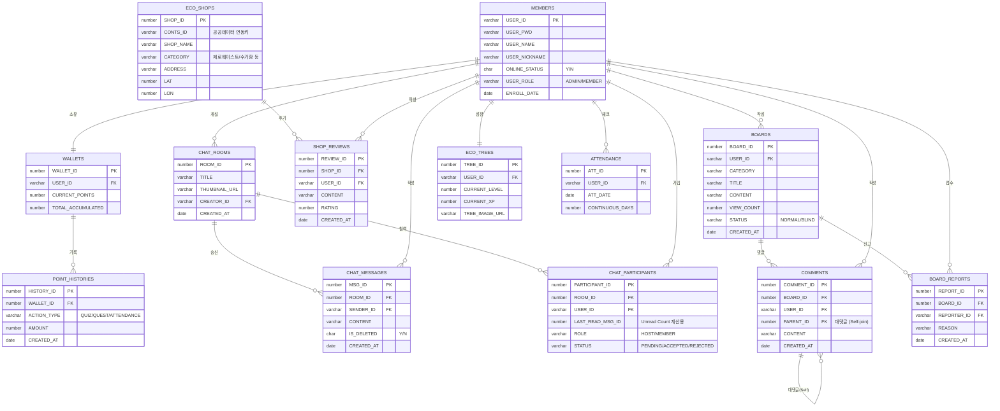

# EasyEarth 프로젝트 ERD (Entity Relationship Diagram)

> **Mermaid `erDiagram` 기반 설계**  
> 이 다이어그램은 5대 핵심 도메인(회원, 채팅, 지도, 커뮤니티, 게이미피케이션) 간의 유기적인 데이터 관계를 시각화합니다.

---

## 💡 데이터 설계 및 정합성 유지 원칙 (Technical Note)
- **수치 정밀도 (Precision)**: 탄소 절감량(`distance * 0.21`)과 같은 환경 수치는 데이터 손실 방지를 위해 Oracle `NUMBER(10, 3)` 타입을 적용하여 소수점 셋째 자리까지 관리합니다.
- **보안 기반 설계**: 비밀번호는 `BCrypt` 10 rounds 암호화를 필수로 하며, `Stateless` 인증을 지원하기 위한 사용자 식별 구조를 갖춥니다.
- **이력 보존 전략**: 포인트 지급 및 게시글 상태 변경 시 정합성을 위해 별도의 히스토리 테이블 또는 `STATUS` 컬럼을 활용한 논리적 관리를 수행합니다.

---

## 📊 1. 전체 도메인 관계도 (Overview)



---

## 🔄 2. 도메인 계층 구조 (Hierarchy View)

```text
MEMBERS (USER_ID)
  ├── WALLETS (USER_ID)
  │     └── POINT_HISTORIES (WALLET_ID)
  ├── ECO_TREES (USER_ID)
  ├── ATTENDANCE (USER_ID)
  ├── CHAT_PARTICIPANTS (USER_ID)
  │     └── CHAT_ROOMS (ROOM_ID)
  │           └── CHAT_MESSAGES (ROOM_ID)
  ├── BOARDS (USER_ID)
  │     ├── COMMENTS (BOARD_ID)
  │     └── BOARD_REPORTS (BOARD_ID)
  └── SHOP_REVIEWS (USER_ID)
```

---

## 📋 3. 테이블 상세 명세 (Data Dictionary)

### 🔑 주요 컬럼 제약사항
| 테이블 | 컬럼 | 타입 | 제약조건 | 설명 / 비고 |
|---|---|---|---|---|
| `MEMBERS` | `USER_PWD` | VARCHAR2(100) | NN | **BCrypt** 단방향 해시 암호화 적용 |
| `MEMBERS` | `ONLINE_STATUS` | CHAR(1) | DEFAULT 'N' | 'Y'(온라인), 'N'(오프라인) 실시간 동기화 |
| `ECO_TREES` | `CURRENT_XP` | NUMBER | DEFAULT 0 | 획득 경험치 (레벨업 로직과 연동) |
| `CHAT_MESSAGES`| `IS_DELETED` | CHAR(1) | DEFAULT 'N' | 'Y'(삭제됨), 'N'(정상) - Soft Delete |
| `CHAT_PARTICIPANTS`| `STATUS` | VARCHAR2(10) | NN | `PENDING`, `ACCEPTED`, `REJECTED` |
| `BOARDS` | `STATUS` | VARCHAR2(10) | NN | `NORMAL`, `BLIND` (신고 10회 누적 시) |
| `POINT_HISTORIES`| `AMOUNT` | NUMBER | NN | 증감 포인트 (+/-) |

### 🏷️ 시퀀스(Sequence) 목록
| 시퀀스명 | 적용 테이블.컬럼 | 설명 |
|---|---|---|
| `SEQ_MEMBER_NO` | `MEMBERS.MEMBER_NO` | 회원 일련번호 |
| `SEQ_CHAT_ROOM` | `CHAT_ROOMS.ROOM_ID` | 채팅방 ID |
| `SEQ_CHAT_MSG` | `CHAT_MESSAGES.MSG_ID` | 메시지 ID |
| `SEQ_BOARD_ID` | `BOARDS.BOARD_ID` | 게시글 ID |
| `SEQ_POINT_HIS` | `POINT_HISTORIES.HISTORY_ID` | 포인트 이력 ID |
| `SEQ_SHOP_ID` | `ECO_SHOPS.SHOP_ID` | 에코 상점 ID |

---

## ⚡ 4. DB 성능 최적화 전략 (Index Strategy)

| 대상 테이블 | 대상 컬럼 | 인덱스 종류 | 기대 효과 |
|---|---|---|---|
| `CHAT_MESSAGES` | `ROOM_ID`, `MSG_ID` | 복합 인덱스 | **커서 기반 페이징** 시 정렬 및 필터링 속도 비약적 향상 |
| `CHAT_PARTICIPANTS` | `ROOM_ID`, `USER_ID` | Unique Index | 중복 참여 방지 및 룸별 멤버 고속 조회 |
| `COMMENTS` | `BOARD_ID`, `PARENT_ID` | Non-Unique | 계층형 대댓글 트리 구조 렌더링 성능 최적화 |
| `BOARD_REPORTS` | `BOARD_ID` | Non-Unique | **Blind System** 처리를 위한 신고 횟수 카운트 성능 개선 |
| `MEMBERS` | `ONLINE_STATUS` | Bitmap Index | 실시간 접속 유저 필터링 및 소셜 상태 동기화 최적화 |
