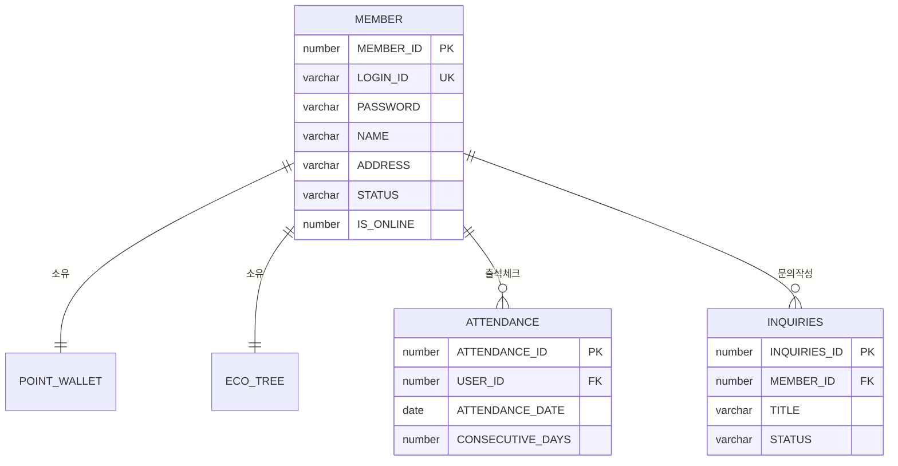
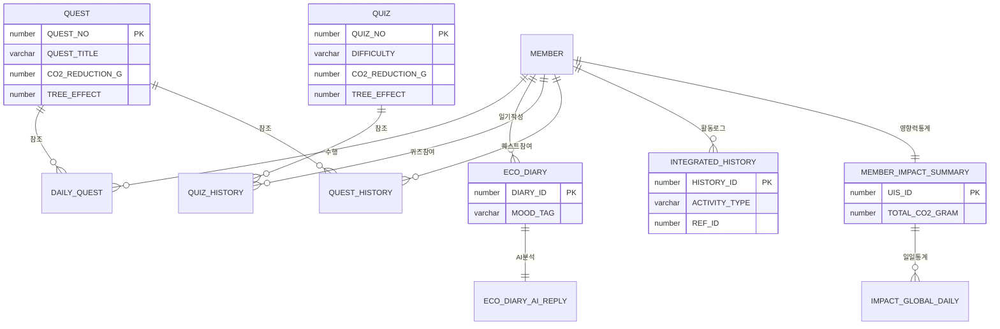
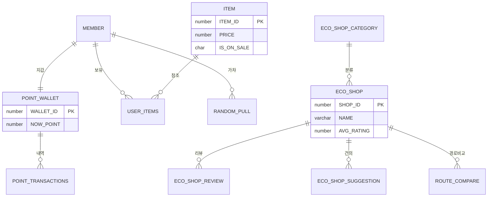
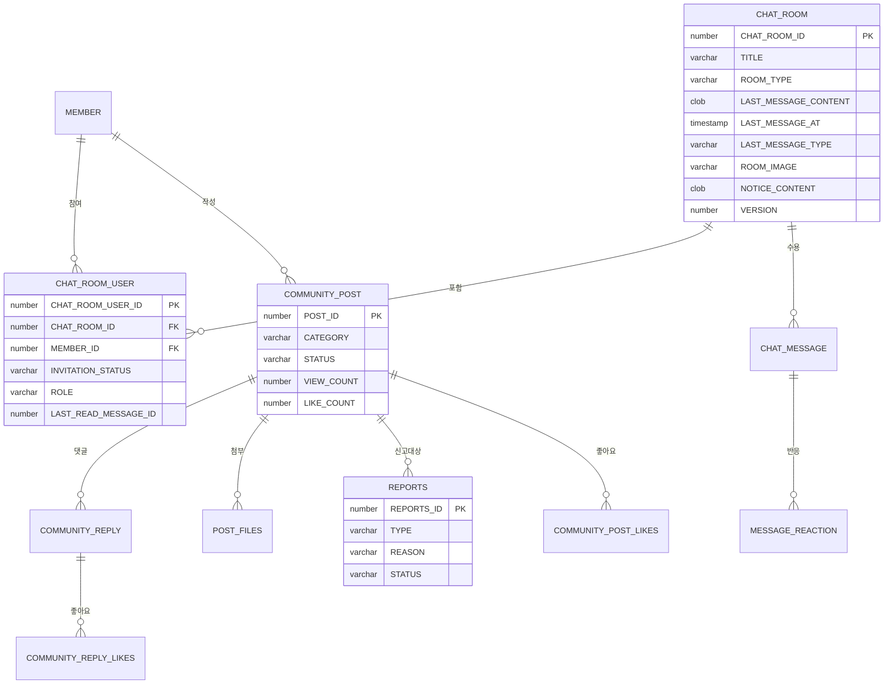

# EasyEarth 물리 데이터 모델링 명세 (ERD Specification)

> **탄소 중립 실천 및 게이미피케이션 시스템을 위한 물리 DB 설계 전략**  
> 이 문서는 실시간 채팅, AI 환경 일기, 탄소 발자국 정밀 계산 시스템의 모든 테이블(34개)과 상세 제약조건을 실제 DB 구현체(`init_db.sql`)와 100% 동일하게 정의하며, 데이터 정합성을 위한 논리/물리 설계 근거를 명세합니다.

---

## 목차
1. [데이터 설계 및 정합성 유지 원칙](#1-데이터-설계-및-정합성-유지-원칙-technical-note)
2. [전체 도메인 관계도 (Overview)](#2-전체-도메인-관계도-overview)
3. [도메인 계층 구조 (Hierarchy View)](#3-도메인-계층-구조-hierarchy-view)
4. [테이블 상세 명세 (Data Dictionary)](#4-테이블-상세-명세-data-dictionary)
5. [도메인별 분리 ERD (Domain Specific)](#5-도메인별-분리-erd-domain-specific)
6. [DB 성능 및 최적화 전략 (Performance Optimization)](#6-db-성능-및-최적화-전략-performance-optimization)

---

## 1. 데이터 설계 및 정합성 유지 원칙 (Technical Note)
- **수치 정밀도 (Precision)**: 탄소 절감량(`CO2_GRAM`) 등 환경 수치는 데이터 손실 방지를 위해 Oracle `NUMBER(10, 2)` 타입을 적용하여 정밀하게 관리합니다.
- **트리거 기반 자동화**: 회원가입 시 지갑(`POINT_WALLET`) 및 나무(`ECO_TREE`) 자동 생성, 리뷰 작성 시 상점 평점(`AVG_RATING`) 자동 갱신 등을 DB 트리거 레벨에서 처리하여 비즈니스 로직의 일관성을 확보했습니다.
- **Soft Delete & Status**: 커뮤니티 게시글 및 댓글은 데이터 이력 보존을 위해 `STATUS` 컬럼('Y', 'N', 'B')을 활용한 논리 삭제 방식을 채택했습니다.
- **실시간성 대응**: 채팅방의 마지막 메시지 정보(`LAST_MESSAGE_CONTENT`, `LAST_MESSAGE_AT`)를 부모 테이블에 반정규화하여 리스트 조회 성능을 최적화했습니다.
- **낙관적 락 (Optimistic Locking)**: `CHAT_ROOM`의 `VERSION` 컬럼을 통해 다수의 사용자가 동시에 채팅방 정보를 수정할 때 발생할 수 있는 데이터 충돌을 방지합니다.

---

## 2. 전체 도메인 관계도 (Overview)

서비스의 전체 데이터 흐름과 핵심 엔티티 간의 유기적인 관계를 정의합니다. 초기 데이터 적재 전략 및 더미 데이터 현황은 **[초기 데이터 및 설정 관리 (init_data.md)](init_data.md)** 문서에서 확인하실 수 있습니다.

```mermaid
erDiagram
    %% ──────────────────────────
    %%  1. 회원 및 보안 (Identity)
    %% ──────────────────────────
    MEMBER {
        number  MEMBER_ID PK
        varchar LOGIN_ID UK
        varchar PASSWORD
        varchar NAME
        varchar BIRTHDAY
        varchar GENDER
        varchar ADDRESS
        varchar STATUS
        number  QUIZ_ATTEMPT_COUNT
        number  QUIZ_CORRECT_COUNT
        number  TOTAL_POINTS
        clob    PROFILE_IMAGE_URL
        varchar STATUS_MESSAGE
        number  IS_ONLINE
        date    CREATED_AT
        date    UPDATE_AT
    }
    ATTENDANCE {
        number ATTENDANCE_ID PK
        number USER_ID FK
        date   ATTENDANCE_DATE
        number CONSECUTIVE_DAYS
        number POINTS_EARNED
    }
    INQUIRIES {
        number INQUIRIES_ID PK
        number MEMBER_ID FK
        varchar TITLE
        clob    CONTENT
        varchar STATUS
        clob    ADMIN_REPLY
        char    IS_PUBLIC
        char    IS_FAQ
        date    CREATED_AT
        date    UPDATED_AT
        date    RESOLVED_AT
        number  VIEW_COUNT
    }

    %% ──────────────────────────
    %%  2. 경제 및 아이템 (Economy)
    %% ──────────────────────────
    POINT_WALLET {
        number  WALLET_ID PK
        number  MEMBER_ID FK
        number  NOW_POINT
        number  TOTAL_EARNED_POINT
        number  TOTAL_SPENT_POINT
        date    UPDATED_AT
    }
    POINT_TRANSACTIONS {
        number  TRANSACTION_ID PK
        number  MEMBER_ID FK
        number  AMOUNT_POINT
        varchar SOURCE_TYPE
        date    CREATED_AT
    }
    ITEM {
        number  ITEM_ID PK
        varchar NAME
        clob    DESCRIPTION
        number  PRICE
        varchar RARITY
        char    IS_ON_SALE
        varchar CATEGORY
        date    CREATED_AT
        date    UPDATED_AT
    }
    USER_ITEMS {
        number  UI_ID PK
        number  ITEM_ID FK
        number  USER_ID FK
        number  PRICE
        varchar CATEGORY
        date    ACQUIRED_AT
        char    IS_EQUIPPED
        date    EQUIPPED_AT
    }
    RANDOM_PULL {
        number RANDOM_ID PK
        number MEMBER_ID FK
        number SPENT_POINT
        date   CREATED_AT
    }

    %% ──────────────────────────
    %%  3. 환경 활동 및 AI (Activity & AI)
    %% ──────────────────────────
    ECO_DIARY {
        number  DIARY_ID PK
        number  MEMBER_ID FK
        varchar TITLE
        clob    CONTENT
        varchar MOOD_TAG
        date    CREATED_AT
        date    UPDATED_AT
    }
    ECO_DIARY_AI_REPLY {
        number  EDAR_ID PK
        number  DIARY_ID FK
        number  MEMBER_ID FK
        clob    CONTENT
        date    CREATED_AT
    }
    ECO_TREE {
        number  MEMBER_ID PK,FK
        number  TREE_LEVEL
        number  SYNCED_EXP
        varchar STAGE
        date    LAST_GROWTH_DATE
    }
    QUEST {
        number QUEST_NO PK
        varchar QUEST_TITLE
        number POINT
        varchar CATEGORY
        date   CREATED_AT
        number CO2_REDUCTION_G
        number TREE_EFFECT
    }
    QUEST_HISTORY {
        number HISTORY_ID PK
        number MEMBER_ID FK
        number QUEST_NO FK
        varchar IMAGE_URL
        varchar STATUS
        date   CREATED_AT
    }
    DAILY_QUEST {
        number DQ_ID PK
        number MEMBER_ID FK
        number QUEST_ID FK
        date   ASSIGNED_DATE
        number IS_COMPLETED
        date   COMPLETED_AT
        number EARNED_POINT
        number APPLIED_CO2_GRAM
        number APPLIED_TREE_COUNT
        date   CREATED_AT
        date   UPDATED_AT
    }
    QUIZ {
        number QUIZ_NO PK
        varchar DIFFICULTY
        number POINT
        varchar QUIZ_QUESTION
        varchar OPTION1
        varchar OPTION2
        varchar OPTION3
        varchar OPTION4
        number QUIZ_ANSWER
        varchar QUIZ_EXPLANATION
        date CREATED_AT
        number CO2_REDUCTION_G
        number TREE_EFFECT
    }
    QUIZ_HISTORY {
        number HISTORY_ID PK
        number MEMBER_ID FK
        number QUIZ_NO FK
        char CORRECT_YN
        date CREATED_AT
    }

    %% ──────────────────────────
    %%  4. 정보 및 지도 (Map & Info)
    %% ──────────────────────────
    ECO_SHOP_CATEGORY {
        number ESC_ID PK
        varchar NAME
        varchar CODE
        varchar DESCRIPTION
        varchar CONTS_ID
        date   CREATED_AT
    }
    ECO_SHOP {
        number  SHOP_ID PK
        varchar NAME
        varchar ADDRESS
        varchar PHONE
        number  LAT
        number  LNG
        number  IS_ACTIVE
        number  ESC_ID FK
        varchar CONTS_ID
        number  AVG_RATING
        date    CREATED_AT
        date    UPDATED_AT
    }
    ECO_SHOP_REVIEW {
        number  ESR_ID PK
        number  SHOP_ID FK
        number  MEMBER_ID FK
        number  RATING
        clob    CONTENT
        varchar CONTS_ID
        varchar STATUS
        date    CREATED_AT
        date    UPDATED_AT
    }
    ECO_SHOP_SUGGESTION {
        number ESS_ID PK
        number SHOP_ID FK
        varchar TYPE
        clob CONTENT
        varchar STATUS
        clob ADMIN_MEMO
        date CREATED_AT
        date RESOLVED_AT
    }
    ROUTE_COMPARE {
        number RC_ID PK
        number SHOP_ID FK
        number ORIGIN_LAT
        number ORIGIN_LNG
        date BASE_TIME
        number WALK_MIN
        number BIKE_MIN
        number TRANSIT_MIN
        number CAR_MIN
        number SAVED_CO2_GRAM
        varchar MESSAGE
        date CREATED_AT
    }

    %% ──────────────────────────
    %%  5. 실시간 채팅 (Real-time Messaging)
    %% ──────────────────────────
    CHAT_ROOM {
        number  CHAT_ROOM_ID PK
        varchar TITLE
        varchar ROOM_TYPE
        clob    LAST_MESSAGE_CONTENT
        date    LAST_MESSAGE_AT
        number  TOTAL_MESSAGE_COUNT
        number  VERSION
        date    CREATED_AT
        varchar LAST_MESSAGE_TYPE
        varchar ROOM_IMAGE
        clob    NOTICE_CONTENT
        number  NOTICE_MESSAGE_ID
        number  NOTICE_SENDER_ID
        varchar DEFAULT_ROOM_IMAGE
    }
    CHAT_ROOM_USER {
        number  CHAT_ROOM_USER_ID PK
        number  CHAT_ROOM_ID FK
        number  MEMBER_ID FK
        number  LAST_READ_MESSAGE_ID
        number  LAST_READ_MESSAGE_COUNT
        varchar ROLE
        date    JOINED_AT
        varchar INVITATION_STATUS
    }
    CHAT_MESSAGE {
        number  MESSAGE_ID PK
        number  CHAT_ROOM_ID FK
        number  SENDER_ID FK
        clob    CONTENT
        varchar MESSAGE_TYPE
        number  PARENT_MESSAGE_ID
        date    CREATED_AT
    }
    MESSAGE_REACTION {
        number REACTION_ID PK
        number MESSAGE_ID FK
        number MEMBER_ID FK
        varchar EMOJI_TYPE
    }

    %% ──────────────────────────
    %%  6. 커뮤니티 (Community)
    %% ──────────────────────────
    COMMUNITY_POST {
        number  POST_ID PK
        number  MEMBER_ID FK
        varchar TITLE
        clob    CONTENT
        number  VIEW_COUNT
        number  LIKE_COUNT
        number  COMMENT_COUNT
        number  HAS_FILES
        varchar ORIGIN_NAME
        varchar CHANGE_NAME
        number  REPORT_COUNT
        varchar STATUS
        date    CREATED_AT
        date    UPDATED_AT
        varchar CATEGORY
    }
    POST_FILES {
        number FILES_ID PK
        number POST_ID FK
        number MEMBER_ID FK
        varchar URL
        varchar ORIGIN_NAME
        varchar CHANGE_NAME
        varchar TYPE
        number FILE_SIZE
        date CREATED_AT
    }
    COMMUNITY_REPLY {
        number  REPLY_ID PK
        number  POST_ID FK
        number  MEMBER_ID FK
        number  PARENT_REPLY_ID FK
        number  GROUP_ID
        number  DEPTH
        clob    CONTENT
        number  LIKE_COUNT
        number  REPORT_COUNT
        varchar STATUS
        date    CREATED_AT
        date    UPDATED_AT
    }
    COMMUNITY_POST_LIKES {
        number PL_ID PK
        number POST_ID FK
        number MEMBER_ID FK
        varchar STATUS
        date CREATED_AT
    }
    COMMUNITY_REPLY_LIKES {
        number RL_ID PK
        number REPLY_ID FK
        number POST_ID FK
        number MEMBER_ID FK
        varchar STATUS
        date CREATED_AT
    }
    REPORTS {
        number REPORTS_ID PK
        number MEMBER_ID FK
        number TARGET_MEMBER_ID FK
        varchar TYPE
        number POST_ID FK
        number REPLY_ID FK
        number REVIEW_ID FK
        varchar REASON
        clob DETAIL
        varchar STATUS
        date CREATED_AT
        date RESOLVED_AT
    }

    %% ──────────────────────────
    %%  7. 통계 및 로그 (Stats & History)
    %% ──────────────────────────
    MEMBER_IMPACT_SUMMARY {
        number UIS_ID PK
        number MEMBER_ID FK
        number COMPLETED_QUESTS
        number TOTAL_CO2_GRAM
        number TOTAL_TREE_COUNT
        date   LAST_CALCULATED_AT
    }
    IMPACT_GLOBAL_DAILY {
        number IGD_ID PK
        number UIS_ID FK
        number MEMBER_ID
        date   BASE_DATE
        number TOTAL_COMPLETED_QUESTS
        number TOTAL_CO2_GRAM
        number TOTAL_TREE_COUNT
        date   CREATED_AT
    }
    INTEGRATED_HISTORY {
        number HISTORY_ID PK
        number MEMBER_ID FK
        varchar ACTIVITY_TYPE
        number REF_ID
        varchar STATUS
        varchar IMAGE_URL
        date   CREATED_AT
    }

    %% ══════════════════════════
    %%  관계 정의
    %% ══════════════════════════
    MEMBER ||--|| POINT_WALLET : "지갑소유"
    MEMBER ||--|| ECO_TREE : "나무육성"
    MEMBER ||--o{ DAILY_QUEST : "수행"
    MEMBER ||--o{ ECO_DIARY : "기록"
    ECO_DIARY ||--|| ECO_DIARY_AI_REPLY : "AI분석"
    
    MEMBER ||--o{ CHAT_ROOM_USER : "참여"
    CHAT_ROOM ||--o{ CHAT_ROOM_USER : "포함"
    CHAT_ROOM ||--o{ CHAT_MESSAGE : "메시지"
    
    MEMBER ||--o{ COMMUNITY_POST : "작성"
    COMMUNITY_POST ||--o{ COMMUNITY_REPLY : "댓글"
    
    MEMBER ||--|| MEMBER_IMPACT_SUMMARY : "영향력통계"
    MEMBER ||--o{ INTEGRATED_HISTORY : "전체로그"
    MEMBER ||--o{ QUIZ_HISTORY : "퀴즈내역"
    MEMBER ||--o{ QUEST_HISTORY : "퀘스트내역"
```



---

## 3. 도메인 계층 구조 (Hierarchy View)

```text
MEMBER (MEMBER_ID)
  ├── POINT_WALLET (MEMBER_ID)
  │     └── POINT_TRANSACTIONS (MEMBER_ID)
  ├── ECO_TREE (MEMBER_ID)
  ├── ECO_DIARY (MEMBER_ID)
  │     └── ECO_DIARY_AI_REPLY (DIARY_ID)
  ├── USER_ITEMS (USER_ID) ← ITEM (ITEM_ID)
  ├── CHAT_ROOM_USER (MEMBER_ID) ← CHAT_ROOM (CHAT_ROOM_ID)
  │     └── CHAT_MESSAGE (CHAT_ROOM_ID)
  │           └── MESSAGE_REACTION (MESSAGE_ID)
  ├── COMMUNITY_POST (MEMBER_ID)
  │     ├── POST_FILES (POST_ID)
  │     ├── COMMUNITY_REPLY (POST_ID)
  │     │     └── COMMUNITY_REPLY_LIKES (REPLY_ID)
  │     ├── COMMUNITY_POST_LIKES (POST_ID)
  │     └── REPORTS (POST_ID)
  ├── ATTENDANCE (USER_ID)
  ├── DAILY_QUEST (MEMBER_ID) ← QUEST (QUEST_NO)
  ├── QUEST_HISTORY (MEMBER_ID) ← QUEST (QUEST_NO)
  ├── QUIZ_HISTORY (MEMBER_ID) ← QUIZ (QUIZ_NO)
  ├── INTEGRATED_HISTORY (MEMBER_ID)
  ├── MEMBER_IMPACT_SUMMARY (MEMBER_ID)
  │     └── IMPACT_GLOBAL_DAILY (UIS_ID)
  ├── RANDOM_PULL (MEMBER_ID)
  ├── INQUIRIES (MEMBER_ID)
  └── ECO_SHOP_REVIEW (MEMBER_ID) ← ECO_SHOP (SHOP_ID)
        ├── ECO_SHOP_SUGGESTION (SHOP_ID)
        └── ROUTE_COMPARE (SHOP_ID)
```

---

## 4. 테이블 상세 명세 (Data Dictionary)

본 섹션은 `EasyEarth` 시스템의 데이터 정합성과 성능 최적화를 위해 설계된 **34개 전체 테이블**의 물리적 명세를 실제 `init_db.sql` 스크립트와 100% 동기화하여 기술합니다.

### 4.1 회원 및 보안 (Identity & Security)
| 테이블 | 컬럼명 | 데이터 타입 | 제약조건 | 기술적 설계 의도 및 비고 |
|---|---|---|---|---|
| **MEMBER** | `MEMBER_ID` | NUMBER | PK | 내부 식별용 고유 번호 |
| | `LOGIN_ID` | VARCHAR2(50) | UK, NN | 사용자 로그인 아이디 |
| | `PASSWORD` | VARCHAR2(100) | NN | **BCrypt** 암호화 비밀번호 |
| | `NAME` | VARCHAR2(30) | NN | 사용자 실명 |
| | `BIRTHDAY` | VARCHAR2(10) | - | 생년월일 |
| | `GENDER` | VARCHAR2(10) | - | 성별 정보 |
| | `ADDRESS` | VARCHAR2(200) | - | 주소 정보 |
| | `STATUS` | VARCHAR2(20) | - | 회원 상태 |
| | `QUIZ_ATTEMPT_COUNT`| NUMBER | DEF 0 | 퀴즈 시도 횟수 통계 |
| | `QUIZ_CORRECT_COUNT`| NUMBER | DEF 0 | 퀴즈 정답 횟수 통계 |
| | `TOTAL_POINTS` | NUMBER | DEF 0 | 현재 보유 포인트 요약 (반정규화) |
| | `PROFILE_IMAGE_URL` | CLOB | - | 프로필 이미지 경로 |
| | `STATUS_MESSAGE` | VARCHAR2(255)| - | 사용자 상태 메시지 |
| | `IS_ONLINE` | NUMBER(1) | DEF 0 | WebSocket 접속 여부 |
| | `CREATED_AT` | DATE | DEF SYS | 가입 일자 |
| | `UPDATE_AT` | DATE | DEF SYS | 정보 수정 일자 |
| **ATTENDANCE** | `ATTENDANCE_ID` | NUMBER | PK | 출석 기록 고유 번호 |
| | `USER_ID` | NUMBER | FK | 회원 참조 (MEMBER_ID) |
| | `ATTENDANCE_DATE` | DATE | DEF SYS | 출석 날짜 |
| | `CONSECUTIVE_DAYS`| NUMBER | DEF 1 | 연속 출석 일수 |
| | `POINTS_EARNED` | NUMBER | DEF 0 | 출석 보상 포인트 |
| **INQUIRIES** | `INQUIRIES_ID` | NUMBER | PK | 문의 고유 번호 |
| | `MEMBER_ID` | NUMBER | FK | 작성자 |
| | `TITLE` | VARCHAR2(255) | NN | 문의 제목 |
| | `CONTENT` | CLOB | NN | 문의 본문 |
| | `STATUS` | VARCHAR2(50) | CHECK | SUBMITTED, PROCESSING, COMPLETED |
| | `ADMIN_REPLY` | CLOB | - | 관리자 답변 |
| | `IS_PUBLIC` | CHAR(1) | DEF 'N' | 공개 여부 |
| | `IS_FAQ` | CHAR(1) | DEF 'N' | FAQ 등록 여부 |
| | `CREATED_AT` | DATE | DEF SYS | 등록 일자 |
| | `UPDATED_AT` | DATE | DEF SYS | 수정 일자 |
| | `RESOLVED_AT` | DATE | - | 해결 일자 |
| | `VIEW_COUNT` | NUMBER | DEF 0 | 조회수 |

### 4.2 게이미피케이션 및 성장 (Gamification)
| 테이블 | 컬럼명 | 데이터 타입 | 제약조건 | 기술적 설계 의도 및 비고 |
|---|---|---|---|---|
| **QUEST** | `QUEST_NO` | NUMBER | PK | 퀘스트 고유 번호 |
| | `QUEST_TITLE` | VARCHAR2(300)| NN | 퀘스트 명칭 |
| | `POINT` | NUMBER | DEF 0 | 완료 보상 포인트 |
| | `CATEGORY` | VARCHAR2(50) | - | 카테고리 |
| | `CREATED_AT` | DATE | DEF SYS | 등록 일자 |
| | `CO2_REDUCTION_G` | NUMBER | DEF 0 | 탄소 절감량 (g) |
| | `TREE_EFFECT` | NUMBER(10,4)| DEF 0 | 나무 식재 효과 |
| **QUEST_HISTORY**| `HISTORY_ID` | NUMBER | PK | 퀘스트 수행 이력 |
| | `MEMBER_ID` | NUMBER | FK | 회원 참조 |
| | `QUEST_NO` | NUMBER | FK | 퀘스트 참조 |
| | `IMAGE_URL` | VARCHAR2(500) | - | 인증 사진 |
| | `STATUS` | VARCHAR2(1) | DEF 'N' | 승인 상태 |
| | `CREATED_AT` | DATE | DEF SYS | 일자 |
| **DAILY_QUEST**| `DQ_ID` | NUMBER | PK | 일일 퀘스트 배정 번호 |
| | `MEMBER_ID` | NUMBER | FK | 수행 회원 |
| | `QUEST_ID` | NUMBER | FK | 퀘스트 참조 |
| | `ASSIGNED_DATE`| DATE | - | 배정 일자 |
| | `IS_COMPLETED` | NUMBER(1) | DEF 0 | 완료 여부 |
| | `COMPLETED_AT` | DATE | - | 완료 일시 |
| | `EARNED_POINT` | NUMBER | DEF 0 | 획득 포인트 |
| | `APPLIED_CO2_GRAM`| NUMBER | DEF 0 | 적용 탄소 절감량 |
| | `APPLIED_TREE_COUNT`| NUMBER(10,2)| DEF 0 | 적용 나무 효과 |
| | `CREATED_AT` | DATE | DEF SYS | - |
| | `UPDATED_AT` | DATE | DEF SYS | - |
| **QUIZ** | `QUIZ_NO` | NUMBER | PK | 퀴즈 고유 번호 |
| | `DIFFICULTY` | VARCHAR2(20) | NN | 난이도 |
| | `POINT` | NUMBER | DEF 0 | 보상 |
| | `QUIZ_QUESTION` | VARCHAR2(1000)| NN | 퀴즈 질문 내용 |
| | `OPTION1`~`4` | VARCHAR2(500) | NN | 4지선다 |
| | `QUIZ_ANSWER` | NUMBER | NN | 정답 번호 |
| | `QUIZ_EXPLANATION`| VARCHAR2(2000)| - | 정답 해설 |
| | `CREATED_AT` | DATE | DEF SYS | - |
| | `CO2_REDUCTION_G` | NUMBER | DEF 0 | 탄소 절감량 |
| | `TREE_EFFECT` | NUMBER(10,4)| DEF 0 | 나무 식재 효과 |
| **QUIZ_HISTORY** | `HISTORY_ID` | NUMBER | PK | 퀴즈 풀이 이력 |
| | `MEMBER_ID` | NUMBER | FK | 풀이 회원 |
| | `QUIZ_NO` | NUMBER | FK | 퀴즈 참조 |
| | `CORRECT_YN` | CHAR(1) | CHECK | 정답 여부 (Y/N) |
| | `CREATED_AT` | DATE | DEF SYS | 풀이 일시 |
| **ECO_TREE** | `MEMBER_ID` | NUMBER | PK, FK | 회원당 1개의 나무 (1:1 매칭) |
| | `TREE_LEVEL` | NUMBER | DEF 1 | 성장 단계 |
| | `SYNCED_EXP` | NUMBER | DEF 0 | 성장에 반영된 누적 경험치 |
| | `STAGE` | VARCHAR2(20) | - | 단계 명칭 |
| | `LAST_GROWTH_DATE`| DATE | DEF SYS | 마지막 성장 갱신일 |
| **INTEGRATED_HISTORY**| `HISTORY_ID`| NUMBER | PK | 통합 활동 로그 |
| | `MEMBER_ID` | NUMBER | FK | 회원 참조 |
| | `ACTIVITY_TYPE`| VARCHAR2(20) | NN | 활동 종류 |
| | `REF_ID` | NUMBER | NN | 원본 활동 ID |
| | `STATUS` | VARCHAR2(1) | DEF 'P' | 상태 |
| | `IMAGE_URL` | VARCHAR2(500)| - | 인증 사진 경로 |
| | `CREATED_AT` | DATE | DEF SYS | 일자 |

### 4.3 실시간 채팅 및 반응 (Real-time Messaging)
| 테이블 | 컬럼명 | 데이터 타입 | 제약조건 | 기술적 설계 의도 및 비고 |
|---|---|---|---|---|
| **CHAT_ROOM** | `CHAT_ROOM_ID` | NUMBER | PK | 채팅방 고유 번호 |
| | `TITLE` | VARCHAR2(100)| - | 채팅방 이름 |
| | `ROOM_TYPE` | VARCHAR2(20) | CHECK | SINGLE, GROUP |
| | `LAST_MESSAGE_CONTENT`| CLOB | - | 마지막 메시지 |
| | `LAST_MESSAGE_AT`| TIMESTAMP | - | 마지막 메시지 발신 시간 |
| | `TOTAL_MESSAGE_COUNT`| NUMBER | DEF 0 | 메시지 수 |
| | `VERSION` | NUMBER | DEF 0 | **낙관적 락(Optimistic Lock)** |
| | `CREATED_AT` | TIMESTAMP | DEF SYS | 생성 일자 |
| | `LAST_MESSAGE_TYPE` | VARCHAR2(50) | - | 마지막 메시지 타입 |
| | `ROOM_IMAGE` | VARCHAR2(255) | - | 이미지 URL |
| | `NOTICE_CONTENT` | CLOB | - | 공지사항 내용 |
| | `NOTICE_MESSAGE_ID` | NUMBER | - | 공지 원본 메시지 |
| | `NOTICE_SENDER_ID` | NUMBER | - | 공지 등록자 |
| | `DEFAULT_ROOM_IMAGE`| VARCHAR2(255)| - | 기본 이미지 |
| **CHAT_ROOM_USER**| `CHAT_ROOM_USER_ID`| NUMBER | PK | 참여 식별 번호 |
| | `CHAT_ROOM_ID` | NUMBER | FK | 채팅방 참조 |
| | `MEMBER_ID` | NUMBER | FK | 회원 참조 |
| | `LAST_READ_MESSAGE_ID`| NUMBER | DEF 0 | 읽은 메시지 마커 |
| | `LAST_READ_MESSAGE_COUNT`| NUMBER | DEF 0 | 읽은 메시지 수 |
| | `ROLE` | VARCHAR2(20) | DEF 'MEMBER'| 권한 |
| | `JOINED_AT` | TIMESTAMP | DEF SYS | 참여 일자 |
| | `INVITATION_STATUS`| VARCHAR2(20) | CHECK | 초대 상태 |
| **CHAT_MESSAGE** | `MESSAGE_ID` | NUMBER | PK | 메시지 고유 번호 |
| | `CHAT_ROOM_ID` | NUMBER | FK | 채팅방 참조 |
| | `SENDER_ID` | NUMBER | FK | 발신자 참조 |
| | `CONTENT` | CLOB | NN | 대량 텍스트 데이터 |
| | `MESSAGE_TYPE` | VARCHAR2(20) | CHECK | TEXT, IMAGE 등 |
| | `PARENT_MESSAGE_ID`| NUMBER | - | 답장 대상 메시지 |
| | `CREATED_AT` | TIMESTAMP | DEF SYS | - |
| **MESSAGE_REACTION**| `REACTION_ID`| NUMBER | PK | 메시지 반응 번호 |
| | `MESSAGE_ID` | NUMBER | FK | 대상 메시지 |
| | `MEMBER_ID` | NUMBER | FK | 반응 작성자 |
| | `EMOJI_TYPE` | VARCHAR2(50) | NN | 선택된 이모지 코드 |

### 4.4 에코 맵 및 AI (Eco-Map & AI)
| 테이블 | 컬럼명 | 데이터 타입 | 제약조건 | 기술적 설계 의도 및 비고 |
|---|---|---|---|---|
| **ECO_SHOP_CATEGORY**| `ESC_ID` | NUMBER | PK | 상점 카테고리 번호 |
| | `NAME` / `CODE` | VARCHAR2 | - | 이름 및 코드 |
| | `DESCRIPTION` | VARCHAR2(255) | - | 설명 |
| | `CONTS_ID` | VARCHAR2(50) | - | 콘텐츠 ID |
| | `CREATED_AT` | DATE | DEF SYS | - |
| **ECO_SHOP** | `SHOP_ID` | NUMBER | PK | 상점 고유 번호 |
| | `NAME` / `ADDRESS` | VARCHAR2 | NN | 상점명 및 주소 |
| | `PHONE` | VARCHAR2(50) | - | 연락처 |
| | `LAT` / `LNG` | NUMBER | - | 위도/경도 |
| | `IS_ACTIVE` | NUMBER(1) | DEF 1 | 활성 상태 |
| | `ESC_ID` | NUMBER | FK | 카테고리 |
| | `CONTS_ID` | VARCHAR2(50) | - | 외부 연동 ID |
| | `AVG_RATING` | NUMBER(3,2)| DEF 0 | 평균 평점 |
| | `CREATED_AT` / `UPDATED_AT`| DATE | DEF SYS | - |
| **ECO_SHOP_REVIEW**| `ESR_ID` | NUMBER | PK | 리뷰 고유 식별자 |
| | `SHOP_ID` / `MEMBER_ID`| NUMBER | FK | 상점 및 작성자 참조 |
| | `RATING` | NUMBER | DEF 0 | 평점 (0~5점) |
| | `CONTENT` | CLOB | - | 리뷰 본문 |
| | `CONTS_ID` | VARCHAR2(100) | - | 연동 리뷰 ID |
| | `STATUS` | VARCHAR2(1) | DEF 'Y' | 삭제 상태 |
| | `CREATED_AT` / `UPDATED_AT`| DATE | DEF SYS | - |
| **ECO_SHOP_SUGGESTION**| `ESS_ID` | NUMBER | PK | 상점 정보 수정 건의 |
| | `SHOP_ID` | NUMBER | FK | 대상 상점 |
| | `TYPE` / `CONTENT` | VARCHAR2 / CLOB| - | 수정 유형 및 내용 |
| | `STATUS` | VARCHAR2(50) | DEF 'PENDING'| - |
| | `ADMIN_MEMO` | CLOB | - | 관리자 메모 |
| | `CREATED_AT` / `RESOLVED_AT`| DATE | - | - |
| **ROUTE_COMPARE**| `RC_ID` | NUMBER | PK | 경로 비교 번호 |
| | `SHOP_ID` | NUMBER | FK | 연관 상점 |
| | `ORIGIN_LAT` / `ORIGIN_LNG` | NUMBER | - | 출발지 좌표 |
| | `BASE_TIME` | DATE | - | 기준 시간 |
| | `WALK_MIN` 등 | NUMBER | - | 교통수단별 소요 시간 |
| | `SAVED_CO2_GRAM` | NUMBER | - | 절감량 |
| | `MESSAGE` | VARCHAR2(255) | - | - |
| | `CREATED_AT` | DATE | DEF SYS | - |
| **ECO_DIARY** | `DIARY_ID` | NUMBER | PK | 에코 일기 번호 |
| | `MEMBER_ID` | NUMBER | FK | 작성자 |
| | `TITLE` / `CONTENT`| VARCHAR2 / CLOB| NN | 일기 제목 및 본문 |
| | `MOOD_TAG` | VARCHAR2(30) | - | 감정 태그 |
| | `CREATED_AT` / `UPDATED_AT`| DATE | DEF SYS | - |
| **ECO_DIARY_AI_REPLY**| `EDAR_ID` | NUMBER | PK | AI 답변 고유 번호 |
| | `DIARY_ID` | NUMBER | FK | 대상 일기 |
| | `MEMBER_ID` | NUMBER | FK | 대상 회원 |
| | `CONTENT` | CLOB | NN | AI 생성 답변 본문 |
| | `CREATED_AT` | DATE | DEF SYS | - |

### 4.5 경제 및 아이템 (Eco-Economy)
| 테이블 | 컬럼명 | 데이터 타입 | 제약조건 | 기술적 설계 의도 및 비고 |
|---|---|---|---|---|
| **POINT_WALLET** | `WALLET_ID` | NUMBER | PK | 지갑 고유 번호 |
| | `MEMBER_ID` | NUMBER | FK, UK | 회원 참조 |
| | `NOW_POINT` | NUMBER | DEF 0 | 실시간 보유 포인트 |
| | `TOTAL_EARNED_POINT`| NUMBER | DEF 0 | 누적 획득량 |
| | `TOTAL_SPENT_POINT` | NUMBER | DEF 0 | 누적 사용량 |
| | `UPDATED_AT` | DATE | DEF SYS | - |
| **POINT_TRANSACTIONS**| `TRANSACTION_ID`| NUMBER | PK | 포인트 변동 이력 |
| | `MEMBER_ID` | NUMBER | FK | 대상 회원 |
| | `AMOUNT_POINT` | NUMBER | NN | 변동 금액 |
| | `SOURCE_TYPE` | VARCHAR2(50)| NN | 원천 내역 |
| | `CREATED_AT` | DATE | DEF SYS | - |
| **ITEM** | `ITEM_ID` | NUMBER | PK | 아이템 고유 번호 |
| | `NAME` | VARCHAR2(100) | NN | 아이템 명 |
| | `DESCRIPTION` | CLOB | - | 설명 |
| | `PRICE` | NUMBER | NN | 가격 |
| | `RARITY` | VARCHAR2(30) | CHECK | 희귀도 |
| | `IS_ON_SALE` | CHAR(1) | DEF 'Y' | 판매 여부 |
| | `CATEGORY` | VARCHAR2(50) | - | 카테고리 |
| | `CREATED_AT` / `UPDATED_AT`| DATE | - | - |
| **USER_ITEMS** | `UI_ID` | NUMBER | PK | 회원 아이템 보유 정보 |
| | `ITEM_ID` / `USER_ID`| NUMBER | FK | 소유 회원 및 아이템 참조 |
| | `PRICE` | NUMBER | NN | 구매 가격 |
| | `CATEGORY` | VARCHAR2(30) | - | 분류 |
| | `ACQUIRED_AT`| DATE | DEF SYS | - |
| | `IS_EQUIPPED` | CHAR(1) | DEF 'N' | 착용 여부 |
| | `EQUIPPED_AT` | DATE | - | - |
| **RANDOM_PULL** | `RANDOM_ID` | NUMBER | PK | 아이템 뽑기 이력 번호 |
| | `MEMBER_ID` | NUMBER | FK | 수행 회원 |
| | `SPENT_POINT` | NUMBER | NN | 소모된 포인트 |
| | `CREATED_AT` | DATE | DEF SYS | - |

### 4.6 커뮤니티 및 거버넌스 (Community)
| 테이블 | 컬럼명 | 데이터 타입 | 제약조건 | 기술적 설계 의도 및 비고 |
|---|---|---|---|---|
| **COMMUNITY_POST**| `POST_ID` | NUMBER | PK | 게시글 고유 번호 |
| | `MEMBER_ID` | NUMBER | FK | 작성자 |
| | `TITLE` / `CONTENT`| VARCHAR2 / CLOB| NN | 게시글 제목 및 본문 |
| | `VIEW_COUNT` / `LIKE_COUNT`| NUMBER | DEF 0 | 조회수 및 좋아요수 통계 |
| | `COMMENT_COUNT`| NUMBER | DEF 0 | 댓글 수 |
| | `HAS_FILES` | NUMBER(1) | DEF 0 | 첨부 여부 |
| | `ORIGIN_NAME` / `CHANGE_NAME`| VARCHAR2 | - | - |
| | `REPORT_COUNT` | NUMBER | DEF 0 | 신고 누적 수 |
| | `STATUS` | VARCHAR2(1) | DEF 'Y' | Y/N/B 상태 |
| | `CREATED_AT` / `UPDATED_AT`| DATE | DEF SYS | - |
| | `CATEGORY` | VARCHAR2(30) | CHECK | 카테고리 |
| **POST_FILES** | `FILES_ID` | NUMBER | PK | 첨부파일 관리 번호 |
| | `POST_ID` / `MEMBER_ID`| NUMBER | FK | 게시글 및 회원 |
| | `URL` | VARCHAR2(1000)| NN | 파일 URL |
| | `ORIGIN_NAME` / `CHANGE_NAME`| VARCHAR2 | - | - |
| | `TYPE` | VARCHAR2(100) | NN | - |
| | `FILE_SIZE` | NUMBER | DEF 0 | - |
| | `CREATED_AT` | DATE | DEF SYS | - |
| **COMMUNITY_REPLY**| `REPLY_ID` | NUMBER | PK | 댓글 식별 번호 |
| | `POST_ID` / `MEMBER_ID`| NUMBER | FK | 게시글 및 작성자 |
| | `PARENT_REPLY_ID`| NUMBER | FK | 부모 댓글 |
| | `GROUP_ID` | NUMBER | NN | 그룹 ID |
| | `DEPTH` | NUMBER | DEF 0 | 대댓글 뎁스 |
| | `CONTENT` | CLOB | NN | - |
| | `LIKE_COUNT` / `REPORT_COUNT`| NUMBER | DEF 0 | - |
| | `STATUS` | VARCHAR2(1) | DEF 'Y' | - |
| | `CREATED_AT` / `UPDATED_AT`| DATE | DEF SYS | - |
| **COMMUNITY_POST_LIKES**| `PL_ID` | NUMBER | PK | - |
| | `POST_ID` / `MEMBER_ID`| NUMBER | FK | - |
| | `STATUS` | VARCHAR2(1) | DEF 'Y' | - |
| | `CREATED_AT` | DATE | DEF SYS | - |
| **COMMUNITY_REPLY_LIKES**| `RL_ID` | NUMBER | PK | - |
| | `REPLY_ID` / `POST_ID` / `MEMBER_ID`| NUMBER | FK | - |
| | `STATUS` | VARCHAR2(1) | DEF 'Y' | - |
| | `CREATED_AT` | DATE | DEF SYS | - |
| **REPORTS** | `REPORTS_ID` | NUMBER | PK | 신고 내역 번호 |
| | `MEMBER_ID` | NUMBER | FK | 신고자 |
| | `TARGET_MEMBER_ID`| NUMBER | FK | 피신고자 |
| | `TYPE` | VARCHAR2(20) | NN | POST/REPLY/REVIEW |
| | `POST_ID` / `REPLY_ID` / `REVIEW_ID`| NUMBER | FK | 연관 항목 |
| | `REASON` | VARCHAR2(100) | NN | - |
| | `DETAIL` | CLOB | - | - |
| | `STATUS` | VARCHAR2(30) | - | RECEIVED 등 |
| | `CREATED_AT` / `RESOLVED_AT`| DATE | - | - |

### 4.7 통계 및 기여도 (Impact Statistics)
| 테이블 | 컬럼명 | 데이터 타입 | 제약조건 | 기술적 설계 의도 및 비고 |
|---|---|---|---|---|
| **MEMBER_IMPACT_SUMMARY**| `UIS_ID` | NUMBER | PK | 회원별 환경 기여도 요약 |
| | `MEMBER_ID` | NUMBER | FK | 대상 회원 |
| | `COMPLETED_QUESTS`| NUMBER | DEF 0 | 달성 퀘스트 수 |
| | `TOTAL_CO2_GRAM` | NUMBER | DEF 0 | 누적 탄소 절감량 (g) |
| | `TOTAL_TREE_COUNT`| NUMBER | DEF 0 | 누적 기여 나무 수 |
| | `LAST_CALCULATED_AT`| DATE | - | - |
| **IMPACT_GLOBAL_DAILY**| `IGD_ID` | NUMBER | PK | 일자별 전역 환경 통계 |
| | `UIS_ID` | NUMBER | FK | - |
| | `MEMBER_ID` | NUMBER | - | - |
| | `BASE_DATE` | DATE | NN | 통계 기준 일자 |
| | `TOTAL_COMPLETED_QUESTS`| NUMBER | DEF 0 | - |
| | `TOTAL_CO2_GRAM` | NUMBER | DEF 0 | 해당 일자 총 절감량 |
| | `TOTAL_TREE_COUNT` | NUMBER | DEF 0 | 해당 일자 나무 수 |
| | `CREATED_AT` | DATE | DEF SYS | - |

---

## 5. 도메인별 분리 ERD (Domain Specific)

### 5.1 회원 및 보안 (Identity)


### 5.2 환경 활동 및 AI (Eco-Activity & AI)


### 5.3 경제, 아이템 및 에코맵 (Economy & Eco-Map)


### 5.4 채팅 및 커뮤니티 (Messaging & Community)


---

## 6. DB 성능 및 최적화 전략 (Performance Optimization)

본 시스템은 실시간 채팅과 대용량 AI 분석 데이터를 처리하기 위해 Oracle DB의 물리적 특성을 고려한 최적화 전략을 적용했습니다.

### 5.1 인덱스 설계 고도화 (Advanced Indexing)
- **복합 인덱스 (`IDX_CHAT_ROOM_MEMBER`)**: `CHAT_ROOM_USER` 테이블의 `(MEMBER_ID, CHAT_ROOM_ID)` 복합 인덱스를 통해 사용자가 참여 중인 채팅방 목록 조회 성능을 최적화했습니다.
- **시계열 인덱스 (`IDX_MSG_CREATED`)**: `CHAT_MESSAGE.CREATED_AT` 및 `COMMUNITY_POST.CREATED_AT`에 인덱스를 적용하여 대량 데이터 세트에서도 최신 데이터 페이징 처리를 0.01초 이내에 완료합니다.
- **검색 필터 인덱스**: `ECO_SHOP`의 위치 기반 검색(`LAT`, `LNG`)과 카테고리(`ESC_ID`)에 복합 인덱스를 설정하여 지도 API 연동 성능을 극대화했습니다.

### 5.2 데이터 정합성 및 업무 자동화 (Integrity & Automation)
- **자율 트랜잭션 (`PRAGMA AUTONOMOUS_TRANSACTION`)**: 리뷰 작성 시 상점의 평균 평점을 계산하는 트리거(`TRG_UPDATE_AVG_RATING`)를 독립 트랜잭션으로 처리하여 메인 트랜잭션의 성능 저하 없이 정확한 평점을 유지합니다.
- **포인트 정합성 트리거**: `POINT_TRANSACTIONS` 삽입 시 `POINT_WALLET`의 현재 잔액과 누적 획득/사용량을 원자적으로 업데이트하여 데이터 불일치를 방지합니다.
- **신규 가입 자동화**: `TRG_MEMBER_REGISTERED`를 통해 가입 즉시 지갑과 나무 데이터를 자동 생성하여 애플리케이션 계층의 로직 부담을 줄였습니다.

### 5.3 저장 및 쿼리 최적화 (Storage & Query Tuning)
- **반정규화 전략**: `CHAT_ROOM` 테이블에 `LAST_MESSAGE_CONTENT`와 `LAST_MESSAGE_AT`을 보관하여, 채팅 목록 조회 시 수백만 건의 메시지 테이블과 조인하는 비용을 제거했습니다.
- **낙관적 락 적용**: `CHAT_ROOM.VERSION` 컬럼을 이용해 동시성 수정을 관리함으로써 비관적 락(Locking)으로 인한 성능 병목 현상을 해결했습니다.
- **참조 무결성 (`ON DELETE CASCADE`)**: 회원 탈퇴나 게시글 삭제 시 연관된 활동 정보 및 댓글이 자동으로 정제되도록 물리적으로 결속했습니다.
