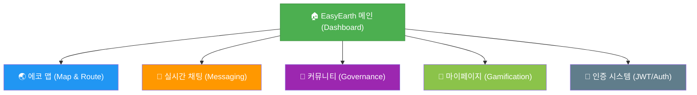
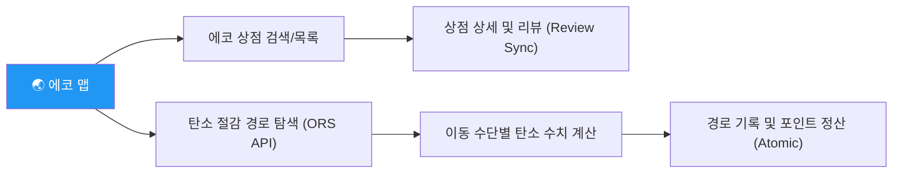
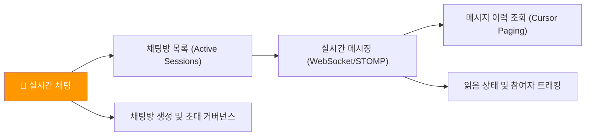
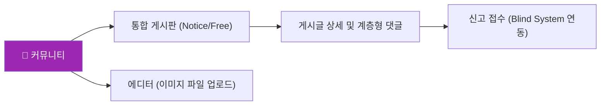
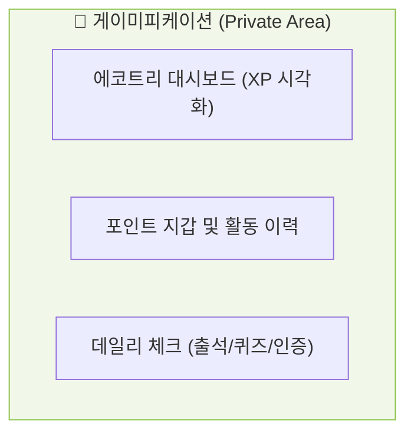

# EasyEarth 파이널 프로젝트 IA (Information Architecture)

> **서비스 전체 계층 구조 및 권한 기반 기능 명세**  
> 이 문서는 파이널 프로젝트의 핵심 도메인별 페이지 접근 권한(Role)과 통신 방식(HTTP/WebSocket)을 정의합니다.  
> 👉 **[상세 리액트 컴포넌트 아키텍처 (react_structure.md) 보러가기](./react_structure.md)**

---

## 📑 목차
1. [사이트 구조 설계 전략 (Technical Note)](#-사이트-구조-설계-전략-technical-note)
2. [전체 사이트 계층 구조 (Overview)](#1-전체-사이트-계층-구조-overview)
3. [도메인별 상세 기능 구조](#2-도메인별-상세-기능-구조)
4. [페이지 목록 및 기술 매핑 명세](#3-페이지-목록-및-기술-매핑-명세)

---

## 💡 사이트 구조 설계 전략 (Technical Note)
- **권한 기반 라우팅**: 모든 페이지 접근은 **JWT(Stateless)** 토큰의 클레임 정보를 기반으로 하며, 관리자(`ADMIN`)와 일반유저(`MEMBER`)의 접근 권한을 물리적/논리적으로 엄격히 격리했습니다.
- **통신 이원화**: 일반적인 데이터 조회/명령은 **REST API(HTTP)**를, 실시간성이 중요한 채팅 기능은 **WebSocket(STOMP)** 프로토콜을 사용하는 이원화된 통신 아키텍처를 채택했습니다.
- **방어적 프론트엔드**: 서버 사이드 인가와 별도로, 클라이언트 단에서도 `Private Route`를 구축하여 권한이 없는 사용자의 접근 시도를 선제적으로 차단했습니다.

## 📊 1. 전체 사이트 계층 구조 (Overview)

---

## 🛠️ 2. 도메인별 상세 기능 구조

### 🌏 에코 맵 (Green Map & Carbon Algo)
> 위치 기반 상점 정보 제공 및 실시간 탄소 절감 경로 산출 기능을 담당합니다.

### 💬 실시간 채팅 (Messaging & Socket)
> WebSocket(STOMP)을 활용한 실시간 통신 및 세션 기반 참여 관리를 담당합니다.

### 📝 커뮤니티 및 보안 (Governance & Community)
> 정보 공유 및 신고 시스템을 통한 자율적 커뮤니티 정화를 담당합니다.

### 🌱 마이페이지 (Eco-Gamification)
> 사용자의 활동 지표 시각화 및 에코트리 성장을 통한 동기 부여를 담당합니다.

---

## 📋 3. 페이지 목록 및 기술 매핑 명세

| 도메인 | 기능명 | URL | 통신 방식 | 권한(Role) |
|---|---|---|:---:|:---:|
| **메인** | 대시보드 (AI 조언) | `/` | HTTP (WebClient) | 공통 |
| **지도** | 경로 탐색 및 탄소 계산 | `/map/route` | HTTP (ORS API) | 공통 |
| **채팅** | 실시간 메시징 | `/chat/:id` | **WebSocket** | 일반회원 |
| **커뮤니티** | 게시글 작성 | `/post/write` | HTTP (Multipart) | 일반회원 |
| **커뮤니티** | 유해물 신고 | `/post/report` | HTTP | 일반회원 |
| **마이페이지** | 에코트리 관리 | `/mypage` | HTTP | 일반회원 |
| **인증** | 로그인 / 회원가입 | `/auth` | HTTP (JWT) | 공통 |
| **관리자** | 신고 게시물 블라인드 처리 | `/admin/report` | HTTP | **ADMIN** |
