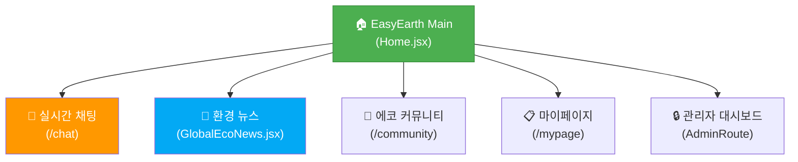
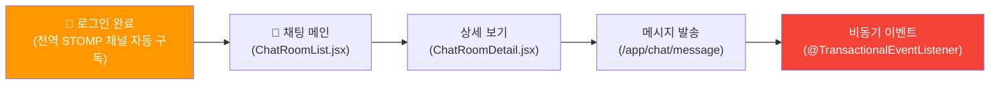
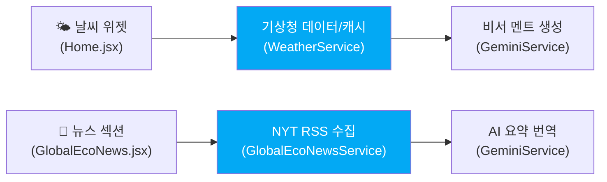

# 🗺️ EasyEarth 파이널 프로젝트 IA (Information Architecture)

> **사용자 경험(UX) 중심의 컴포넌트 계층 구조 및 API 통신 명세**  
> 이 문서는 React 기반 프론트엔드의 라우팅 구조(`AppRouter.jsx`)와 백엔드 API 엔드포인트를 기반으로 플랫폼의 정보 구조와 데이터 흐름을 정의합니다.

---

## 📑 목차
1. [📊 서비스 레이아웃 (Overview)](#1-서비스-레이아웃-overview)
2. [🐾 도메인별 상세 아키텍처](#2-도메인별-상세-아키텍처)
3. [📑 페이지 및 API 상세 명세](#3-페이지-및-api-상세-명세)

---

## 📊 1. 서비스 레이아웃 (Overview)

사이트의 핵심 메뉴는 GNB(Global Navigation Bar)를 통해 제어되며, 각 도메인은 React Router의 `PrivateRoute`, `PublicRoute` 등 권한 기반 가드 시스템을 거쳐 렌더링됩니다.

---

## 2. 도메인별 상세 아키텍처

> [!NOTE]
> 실시간 양방향 통신이 발생하는 **채팅 시스템**과 외부 API 및 생성형 AI가 융합된 **환경(날씨/뉴스) 시스템**은 본 플랫폼의 백엔드 핵심 코어 인프라이므로, 하기에 상세 프로세스를 정의합니다.

### 💬 2.1 채팅 도메인 (Chat & Notification)
전역(Global) 알림을 수신하는 메인 소켓 채널과 각 채팅방 내부의 로컬 통신 채널이 병렬적으로 동작합니다.

### 🌤️ 2.2 날씨 및 뉴스 도메인 (Weather & AI News)
외부 자원(공공데이터, RSS 피드)을 서버 로컬 파일 캐시(FileCache)로 적재하고, Gemini AI를 통해 데이터를 가공하여 프론트엔드로 전달합니다.

---

## 📑 3. 페이지 및 API 상세 명세

| 도메인 | 기능(Feature) | URL 경로 (Endpoint) | 통신 방식 | 권한(Route Guard) |
|---|---|---|---|---|
| **채팅** | 채팅방 목록 및 생성 | `/chat` | **REST (JSON)** | PrivateRoute |
| **채팅** | 실시간 채팅 및 알림 채널 | `ws://domain/ws-stomp` | **STOMP (WebSocket)** | PrivateRoute |
| **날씨** | 전국 기상청 공공데이터 | `/weather/forecast` | REST (JSON) | PublicRoute |
| **AI 비서** | AI 기반 실천 조언 | `/gemini/secretary` | REST (JSON) | PublicRoute |
| **뉴스** | 글로벌 환경 뉴스 연동 | `/global/eco-news` | REST (JSON) | PublicRoute |
| **인증** | 카카오 소셜 연동 | `/api/auth/kakao` | REST (JSON) | PublicRoute |
| **보안** | JWT 토큰 갱신 | `/api/auth/refresh` | REST (JSON) | PrivateRoute |
| **회원** | 프로필 및 지갑 내역 | `/member/profile` | REST (JSON) | PrivateRoute |

---

### 💡 문서 활용 가이드
- **STOMP (WebSocket)**: 클라이언트의 지속적인 폴링(Polling) 없이 서버가 클라이언트로 데이터를 즉시 푸시(Push)할 수 있는 실시간 양방향 통신 계층입니다.
- **REST (JSON)**: 프론트엔드의 전역 인터셉터(`apis/axios.jsx`)를 통해 `Authorization: Bearer` 헤더가 자동 첨부되어 통신합니다.
- **Route Guard**: React Router의 `PrivateRouter` 및 `AuthContext`를 통해 토큰 만료 또는 비인가 사용자의 페이지 접근을 원천 차단합니다.
