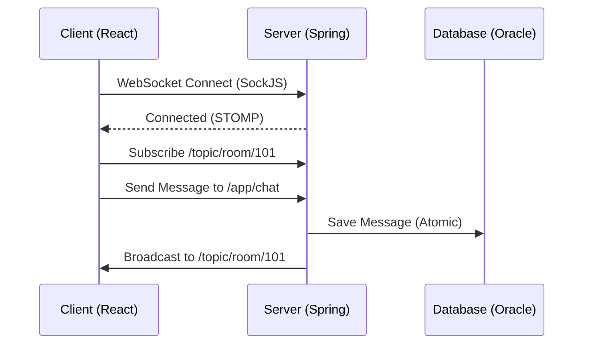
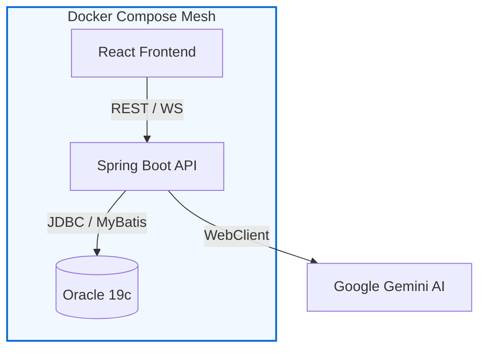

# 🏗️ EasyEarth 파이널 프로젝트 Infrastructure Architecture

> **실시간 통신, AI 파이프라인 및 인프라 설계 명세**  
> 이 문서는 파이널 프로젝트의 핵심 기술적 차별점인 실시간 메시징 엔진, AI 연동 아키텍처, 그리고 컨테이너 기반의 배포 인프라를 정의합니다.

---

## 📑 목차
1. [인프라 설계 전략 (Technical Note)](#-인프라-설계-전략-technical-note)
2. [실시간 메시징 엔진 (WebSocket/STOMP)](#1-실시간-메시징-엔진-websocketstomp)
3. [AI 데이터 파이프라인 (Gemini & WebClient)](#2-ai-데이터-파이프라인-gemini--webclient)
4. [컨테이너 아키텍처 (Docker & DevOps)](#3-컨테이너-아키텍처-docker--devops)

---

## 💡 인프라 설계 전략 (Technical Note)
- **실시간성 확보**: 단순 HTTP Polling 방식의 한계를 극복하기 위해 **WebSocket** 상위에 **STOMP** 프로토콜을 계층화하여, 효율적인 Pub/Sub 구조의 실시간 채팅 환경을 구축했습니다.
- **성능 최적화**: AI 연동 시 발생하는 지연 시간을 최소화하기 위해 **Spring WebClient**를 통한 비동기 통신을 채택하고, **Caffeine/File Cache**를 활용하여 동일 요청에 대한 중복 연산을 방지했습니다.
- **환경 일관성**: `Docker`를 통한 인프라의 코드화(IaC)로 로컬 개발 환경과 실제 배포 환경 간의 기술적 간극을 제거하고 재현성을 확보했습니다.

---

## 💬 1. 실시간 메시징 엔진 (WebSocket/STOMP)

사용자 간의 끊김 없는 소통을 위해 구축된 실시간 통신 아키텍처입니다.

### 1.1 Messaging Flow
1. **Connect**: 클라이언트가 SockJS를 통해 서버와 핸드쉐이킹을 수행합니다.
2. **Subscribe**: 특정 채팅방 ID(`/topic/room/{id}`)를 구독하여 해당 방의 메시지를 수신 대기합니다.
3. **Publish**: 클라이언트가 메시지를 전송하면 서버의 `@MessageMapping` 핸들러가 이를 수신하여 DB 저장 및 해당 방 구독자들에게 브로드캐스팅합니다.

---

## 🤖 2. AI 데이터 파이프라인 (Gemini & WebClient)

환경 보호 가이드 제공을 위한 AI 통신 및 최적화 아키텍처입니다.

### 2.1 Non-blocking AI Pipeline
- **WebClient**: 기존의 RestTemplate(Blocking) 대신 비동기 방식인 WebClient를 사용하여 AI 응답을 기다리는 동안 서버의 워커 쓰레드가 차단되지 않도록 설계했습니다.
- **캐싱 전략**: Gemini API의 호출 비용과 응답 시간을 줄이기 위해, 빈번하게 요구되는 환경 데이터는 **Caffeine Cache** 또는 **Local JSON Cache**에 저장하여 즉시 반환합니다.

---

## 🐳 3. 컨테이너 아키텍처 (Docker & DevOps)

시스템의 모든 구성 요소를 독립적인 컨테이너로 격리하여 관리합니다.

### 3.1 Docker Compose Layer
- **App Container**: Spring Boot 어플리케이션 및 Java 실행 환경.
- **Web Container**: React 빌드 결과물 및 Nginx(또는 정적 파일 서빙 환경).
- **DB Container**: Oracle 19c 인스턴스 및 초기화 스크립트(`data.sql`) 자동 실행.

