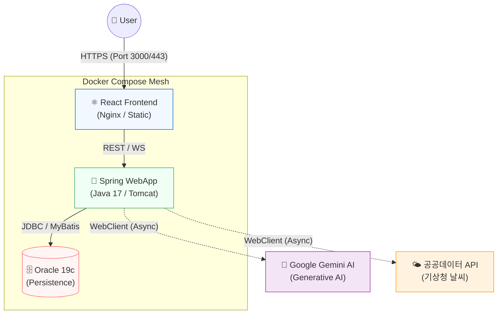
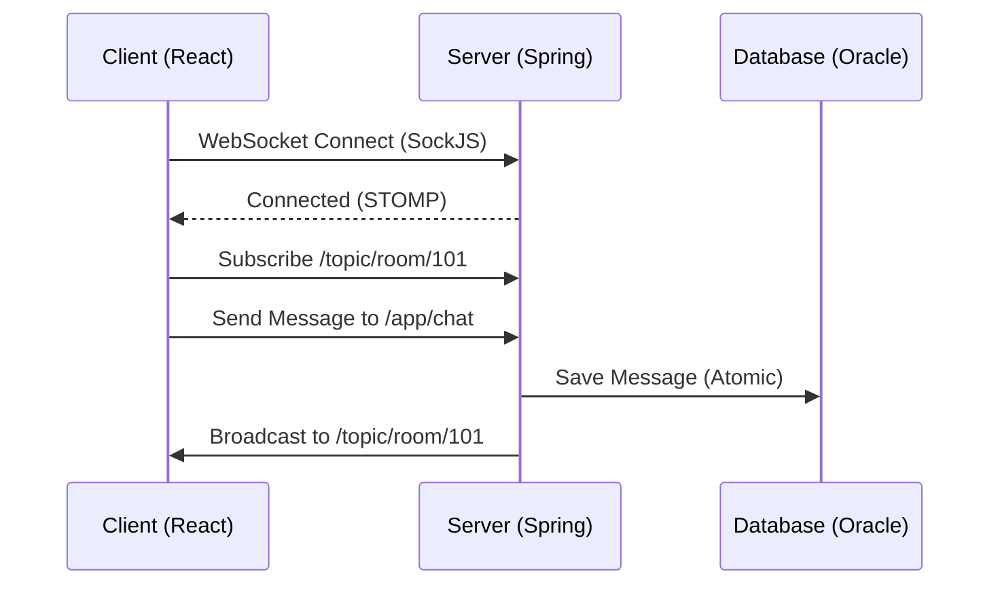

# 🏗️ EasyEarth 파이널 프로젝트 Infrastructure Architecture

> **실시간 통신, AI 파이프라인 및 도메인 중심 설계 명세**  
> 이 문서는 파이널 프로젝트의 핵심 기술적 차별점인 실시간 메시징 엔진, 비동기 AI 파이프라인, 그리고 컨테이너 기반의 물리/논리 아키텍처를 정의합니다.

---

## 📑 목차
1. [🏢 물리 인프라 아키텍처 (Docker & Container)](#1-물리-인프라-아키텍처-docker--container)
2. [📦 소프트웨어 아키텍처 (Domain-First Package)](#2-소프트웨어-아키텍처-domain-first-package)
3. [📊 데이터 흐름 및 통신 아키텍처 (Messaging & AI Pipeline)](#3-데이터-흐름-및-통신-아키텍처-messaging--ai-pipeline)
4. [🗄️ 데이터베이스 설계 전략 (Persistence Layer)](#4-데이터베이스-설계-전략-persistence-layer)
5. [🛡️ 보안 및 방어적 설계 (Security & Integrity)](#5-보안-및-방어적-설계-security--integrity)

---

## 🏢 1. 물리 인프라 아키텍처 (Docker & Container)

본 프로젝트는 서비스 구성 요소의 완벽한 격리와 개발/운영 환경의 일관성 유지를 위해 **Docker Compose 기반 컨테이너 망**을 구축했습니다.

- **App Container (Spring Boot)**: 비즈니스 로직을 처리하는 핵심 서버 컨테이너.
- **Web Container (React)**: React 빌드 결과물을 Nginx를 통해 빠르게 정적 서빙하는 프론트엔드 컨테이너.
- **DB Container (Oracle 19c)**: 데이터베이스 인스턴스 격리 및 구동 시점의 `init_db.sql` 자동 실행을 통한 초기화 보장.
- **인프라 코드화 (IaC)**: `docker-compose.yml`을 통해 모든 컨테이너의 네트워크 바인딩과 볼륨 마운트를 명세하여 이식성 극대화.

---

## 📦 2. 소프트웨어 아키텍처 (Domain-First Package)

코드 가독성과 유지보수성을 높이기 위해 기술 계층 중심(Controller, Service...)이 아닌 **비즈니스 도메인 단위**로 패키지를 분리 설계했습니다.

### 2.1 Backend Package 구조 (Spring Boot)
- `com.easyearth.member`: JWT 기반 인증/인가, 회원 프로필, 소셜 로그인 연동
- `com.easyearth.chat`: WebSocket/STOMP 프로토콜 설정, 채팅방 관리, 메시지 브로드캐스팅
- `com.easyearth.eco`: 에코 맵, 상점 리뷰, AI 기반 환경 일기 분석 및 피드백 생성
- `com.easyearth.community`: 커뮤니티 게시판, 첨부파일, 신고 및 거버넌스
- `com.easyearth.quest`: 게이미피케이션(퀴즈, 퀘스트), 에코 트리 성장 및 포인트 통계

### 2.2 Frontend Package 구조 (React)
- `src/apis`: 비동기 요청 중앙화, 도메인별 분리된 API 함수 및 Axios Interceptor 관리
- `src/components`: 재사용 가능한 UI 모듈 분리 (Atom 수준의 `common` 컴포넌트 활용)
- `src/context`: AuthContext(인증 상태), ChatContext(웹소켓 세션 유지) 전역 상태 공유

---

## 📊 3. 데이터 흐름 및 통신 아키텍처 (Messaging & AI Pipeline)

일반적인 HTTP 요청(Blocking)의 한계를 넘어서는 고성능 실시간 통신 및 비동기 처리 파이프라인입니다.

### 3.1 실시간 메시징 엔진 (WebSocket/STOMP)
사용자 간의 끊김 없는 양방향 소통을 위해 구축된 채팅 아키텍처입니다.

1. **Connect**: 클라이언트가 SockJS를 통해 서버와 핸드쉐이킹을 수행하여 웹소켓 세션을 수립.
2. **Subscribe**: 특정 채팅방 ID(`/topic/room/{id}`)를 구독하여 메인 스레드 부하 없이 수신 채널 대기.
3. **Publish**: 클라이언트가 메시지 전송 시 `@MessageMapping`이 이를 낚아채 DB에 비동기 저장하고 해당 방 구독자 전원에게 브로드캐스팅.

### 3.2 AI 분석 및 비동기 데이터 파이프라인
외부 생성형 AI(Gemini)와 공공데이터 연동 시 발생하는 지연(Latency) 문제를 해결하기 위한 구조입니다.

- **Non-blocking WebClient**: 기존의 RestTemplate(동기/차단) 방식 대신 Spring WebFlux의 `WebClient`를 채택. AI API 응답을 대기하는 동안 톰캣의 워커 스레드가 차단되지 않도록 하여 다중 사용자 환경에서 서버 마비를 방지.
- **다중 캐싱(Caching) 전략**: 외부 API의 Rate Limit 방지 및 응답 속도 최적화.
  - **Local File Cache**: 날씨 등 변동성이 상대적으로 낮은 공공데이터를 로컬 JSON 형태로 임시 저장.
  - **Caffeine Cache (Memory)**: AI가 빈번하게 반환하는 답변 템플릿(일일 환경 팁 등)을 인메모리에 적재하여 0.01초 내로 응답.

---

## 🗄️ 4. 데이터베이스 설계 전략 (Persistence Layer)

대용량 데이터 조회 시의 부하를 줄이고 무결성을 지키는 DB 설계 전략입니다.

- **반정규화 설계 (De-normalization)**: 채팅방 목록 조회 시 수백만 건의 `CHAT_MESSAGE` 테이블과 매번 조인하는 병목을 막기 위해, `CHAT_ROOM` 부모 테이블에 `LAST_MESSAGE_CONTENT`와 `LAST_MESSAGE_AT`을 반정규화하여 직접 기록.
- **DB 트리거 기반 자동화**: 에코 샵에 새 리뷰(`ECO_SHOP_REVIEW`)가 등록/수정/삭제될 때마다 해당 상점의 `AVG_RATING` 컬럼을 자율 트랜잭션(`PRAGMA AUTONOMOUS_TRANSACTION`) 트리거로 갱신하여 정합성 보장.
- **동시성 제어 (Optimistic Locking)**: 낙관적 락핑을 위해 `CHAT_ROOM` 테이블에 `VERSION` 컬럼을 도입, 다중 스레드 수정 환경에서 데이터 충돌(Lost Update) 원천 차단.

---

## 🛡️ 5. 보안 및 방어적 설계 (Security & Integrity)

비즈니스 로직과 데이터를 보호하기 위한 다층 보안 체계입니다.

- **Stateless JWT 인증**: 세션 불일치 문제를 해결하기 위해 JWT(Access/Refresh Token) 사용. React 프론트의 `Axios Interceptor`를 통해 모든 API 요청 헤더에 토큰을 자동 주입하고, 만료(401) 시 자동 갱신 및 로그아웃 파이프라인 수행.
- **트랜잭션 원자성(Atomicity)**: 사용자의 활동 보상 흐름(퀘스트 완료 $\rightarrow$ 포인트 잔액 갱신 $\rightarrow$ 나무 경험치 증가 $\rightarrow$ 통합 활동 로그 적재) 전체를 단일 `@Transactional` 애노테이션으로 묶어, 예외 발생 시 모든 상태를 Rollback하여 경제 시스템의 무결성 보장.
- **취약점 방어**: 
  - **SQL Injection**: MyBatis의 바인딩 파라미터(`#{}`)를 통해 쿼리 주입 공격 차단.
  - **XSS (크로스 사이트 스크립팅)**: 외부 노출이 잦은 커뮤니티 본문 출력 시 React JSX 고유의 텍스트 이스케이프 기능을 활용.
