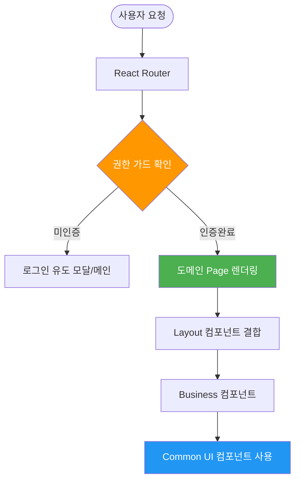

# ⚛️ EasyEarth 파이널 프로젝트 React Architecture

> **컴포넌트 기반 아키텍처 및 프론트엔드 설계 명세**  
> 이 문서는 파이널 프로젝트의 리액트 프론트엔드 구조, 상태 관리 전략, 그리고 백엔드와의 효율적인 통신 아키텍처를 정의합니다.

---

## 📑 목차
1. [프론트엔드 설계 원칙 (Technical Note)](#-프론트엔드-설계-원칙-technical-note)
2. [상세 폴더 구조 (Project Structure)](#1-상세-폴더-구조-project-structure)
3. [상태 관리 및 보안 (State & Auth)](#2-상태-관리-및-보안-state--auth)
4. [라우팅 시스템 설계 (Routing System)](#3-라우팅-시스템-설계-routing-system)
5. [공통 컴포넌트 활용 전략 (Common Components)](#4-공통-컴포넌트-활용-전략-common-components)

---

## 💡 프론트엔드 설계 원칙 (Technical Note)
- **컴포넌트 재사용성**: 아토믹 디자인 패턴의 개념을 차용하여 `shared` 폴더에 공통 UI 컴포넌트를 분리, 코드 중복을 최소화하고 유지보수성을 높였습니다.
- **Stateless 인증 유지**: 세션 대신 **JWT**를 사용하며, `Axios Interceptor`를 통해 모든 API 요청 시 자동으로 토큰을 주입하고 만료 시 중앙 집중형 에러 핸들링을 수행합니다.
- **반응형 대시보드**: 사용자 활동 지표(탄소 절감량, 에코트리 성장 등)를 시각화하기 위해 최적화된 상태 업데이트 로직과 반응형 레이아웃을 적용했습니다.

---

## 📊 1. 전체 폴더 구조 (Project Structure)

파이널 프로젝트의 프론트엔드 소스코드는 역할별로 엄격히 계층화되어 관리됩니다.

```bash
src/
├── 📁 apis/            # [Network] API 통신 계층
│   ├── axios.jsx       # Axios 인스턴스 (Interceptor: JWT 주입 및 에러 핸들링)
│   ├── authApi.js      # 인증/인가 관련 API (Login, Signup)
│   ├── chatApi.js      # 실시간 채팅 및 메시지 이력 API
│   └── ...             # domain-specific API 파일들 (weather, community 등)
├── 📁 components/      # [UI] 컴포넌트 계층
│   ├── 📁 common/      # [CORE] 범용 UI 컴포넌트 (Button, Input, Modal, Profile)
│   ├── 📁 layout/      # 화면 뼈대 컴포넌트 (Header, Footer, Sidebar, Navigation)
│   ├── 📁 chat/        # 채팅방 리스트, 메시지 버블, 입력창 등 실시간 UI
│   └── 📁 map/         # Naver Map API 연동 및 마커/클러스터링 UI
├── 📁 context/         # [State] Context API 전역 상태 계층
│   ├── AuthContext.jsx # 사용자 인증 상태, 토큰 및 프로필 전역 공유
│   ├── ChatContext.jsx # 실시간 STOMP 메시지 수신 및 채팅 상태 관리
│   └── NotificationContext.jsx # 플랫폼 전역 실시간 알림 시스템 관리
├── 📁 pages/           # [Page] 도메인 단위 메인 페이지
│   ├── 📁 MainPage/    # 서비스 메인 랜딩 및 대시보드
│   ├── 📁 MyPage/      # 회원 정보 수정, 활동 내역, 인벤토리 관리
│   ├── 📁 CommunityPage/ # 커뮤니티 게시판 및 상세 페이지
│   └── ...             # Shop, Map, Reports 등 주요 도메인 페이지
├── 📁 router/          # [Navigation] 라우팅 시스템 계층
│   ├── AppRouter.jsx   # 전체 서비스 URL 경로 매핑 및 레이아웃 결합
│   └── PrivateRouter.jsx # 권한 기반(Auth Guard) 접근 통제 로직
├── 📁 styles/          # [Style] 글로벌 스타일 및 테마 설정
├── 📁 utils/           # [Util] 공통 유틸리티 (Date 포맷팅, 이미지 유틸 등)
├── App.jsx             # 최상위 컴포넌트 (라우터 및 컨텍스트 결합)
└── main.jsx            # 어플리케이션 진입점 (DOM 렌더링)
```

---

## 🔐 2. 상태 관리 및 보안 (State & Auth)

### 2.1 Context API 기반 전역 상태
- **AuthContext**: 사용자의 로그인 상태, JWT 토큰 정보, 프로필 정보를 앱 전체에서 공유합니다.
- **실시간 데이터 동기화**: WebSocket(STOMP)을 통해 유입되는 실시간 채팅 알림이나 포인트 변동 사항을 Context를 통해 즉시 UI에 반영합니다.

### 2.2 Axios Interceptor 파이프라인
- **Request Interceptor**: 모든 API 요청 헤더에 `Authorization: Bearer [TOKEN]`을 자동으로 삽입합니다.
- **Response Interceptor**: 서버로부터 401(Unauthorized) 또는 403(Forbidden) 응답 수신 시, 자동으로 세션을 정리하고 로그인 페이지로 리다이렉트하는 방어적 로직을 구현했습니다.

---

## 🛣️ 3. 라우팅 시스템 설계 (Routing System)

사용자 권한에 따라 페이지 접근을 통제하고, 선언적인 라우팅 구조를 유지합니다.

### 3.1 AppRouter 구조
- **중앙 집중형 관리**: 모든 페이지 경로를 `AppRouter.jsx` 한 곳에서 관리하여 가독성을 높였습니다.
- **권한 가드(Guard)**: `PrivateRoute`, `PublicRoute`, `AdminRoute`를 통해 인증 상태에 따른 자동 리다이렉션을 수행합니다.

```javascript
// src/router/AppRouter.jsx (주요 구조)
<Routes>
  {/* 일반 페이지 */}
  <Route path="/" element={<MainPage />} />
  <Route path="/community" element={<CommunityPage />} />

  {/* 인증 필수 페이지 (로그인 필요) */}
  <Route path="/mypage" element={<PrivateRoute><MyPage /></PrivateRoute>} />
  <Route path="/dashboard" element={<PrivateRoute><DashboardPage /></PrivateRoute>} />

  {/* 관리자 전용 페이지 (신고 관리) */}
  <Route path="/reports" element={<AdminRoute><ReportsPage /></AdminRoute>} />
</Routes>
```

### 3.2 PrivateRouter (Guard Logic)
- **인증 상태 조회**: `AuthContext`의 `isAuthenticated` 값을 참조하여 접근 허용 여부를 판별합니다.
- **자동 리다이렉트**: 비인가 접근 시 `Navigate` 컴포넌트를 사용하여 메인 또는 로그인 유도 모달로 즉시 이동시킵니다.

---

## 🛠️ 4. 공통 컴포넌트 활용 전략 (Common Components)

디자인 시스템의 일관성을 유지하고 개발 생산성을 높이기 위해 `src/components/common`에 공통 컴포넌트를 구축했습니다.

### 4.1 공통 컴포넌트 종류
- **Button.jsx**: `color`, `width`, `height`, `hover` 효과 등을 props로 받아 다양한 스타일의 버튼을 프로젝트 전역에서 공통적으로 관리합니다.
- **Input.jsx**: `label`, `error`, `helperText` 속성을 지원하며, 에러 메시지 노출 로직을 캡슐화하여 폼(Form) 구현 시 반복 코드를 제거했습니다. (forwardRef 적용)
- **CustomModal.jsx**: `alert`, `confirm` 타입을 지원하며, `createPortal`을 활용한 **Modal.jsx**와 함께 UI 계층 구조와 관계없이 최상단에 렌더링되도록 설계되었습니다.

### 4.2 컴포넌트 렌더링 흐름 (Rendering Flow)


