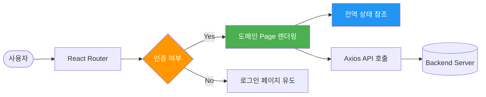

# ⚛️ EasyEarth 파이널 프로젝트 React Architecture

> **컴포넌트 기반 아키텍처 및 프론트엔드 설계 명세**  
> 이 문서는 파이널 프로젝트의 리액트 프론트엔드 구조, 상태 관리 전략, 그리고 백엔드와의 효율적인 통신 아키텍처를 정의합니다.

---

## 📑 목차
1. [프론트엔드 설계 원칙 (Technical Note)](#-프론트엔드-설계-원칙-technical-note)
2. [전체 폴더 구조 (Project Structure)](#1-전체-폴더-구조-project-structure)
3. [상태 관리 및 보안 (State & Auth)](#2-상태-관리-및-보안-state--auth)
4. [컴포넌트 설계 전략 (Component Strategy)](#3-컴포넌트-설계-전략-component-strategy)

---

## 💡 프론트엔드 설계 원칙 (Technical Note)
- **컴포넌트 재사용성**: 아토믹 디자인 패턴의 개념을 차용하여 `shared` 폴더에 공통 UI 컴포넌트를 분리, 코드 중복을 최소화하고 유지보수성을 높였습니다.
- **Stateless 인증 유지**: 세션 대신 **JWT**를 사용하며, `Axios Interceptor`를 통해 모든 API 요청 시 자동으로 토큰을 주입하고 만료 시 중앙 집중형 에러 핸들링을 수행합니다.
- **반응형 대시보드**: 사용자 활동 지표(탄소 절감량, 에코트리 성장 등)를 시각화하기 위해 최적화된 상태 업데이트 로직과 반응형 레이아웃을 적용했습니다.

---

## 📊 1. 전체 폴더 구조 (Project Structure)

파이널 프로젝트의 프론트엔드 소스코드는 역할별로 엄격히 계층화되어 관리됩니다.

```bash
src/
├── 📁 apis/        # Axios 인스턴스 및 백엔드 API 엔드포인트 정의
├── 📁 components/  # 기능별 재사용 컴포넌트
├── 📁 context/     # 전역 상태 관리 (Auth, Theme 등 Context API)
├── 📁 pages/       # 서비스 도메인별 메인 페이지 컴포넌트
├── 📁 router/      # React Router 기반의 라우팅 매핑 및 권한 가드
├── 📁 shared/      # 공통 레이아웃, 버튼 등 범용 컴포넌트
├── 📁 styles/      # 전역 스타일링 및 테마 설정 (CSS Variable)
├── 📁 utils/       # 시간 변환, 수치 계산 등 공통 유틸리티 함수
├── App.jsx         # 라우터 및 프로바이더가 결합된 최상위 컴포넌트
└── main.jsx        # 어플리케이션 엔트리 포인트
```

---

## 🔐 2. 상태 관리 및 보안 (State & Auth)

### 2.1 Context API 기반 전역 상태
- **AuthContext**: 사용자의 로그인 상태, JWT 토큰 정보, 프로필 정보를 앱 전체에서 공유합니다.
- **실시간 데이터 동기화**: WebSocket(STOMP)을 통해 유입되는 실시간 채팅 알림이나 포인트 변동 사항을 Context를 통해 즉시 UI에 반영합니다.

### 2.2 Axios Interceptor 파이프라인
- **Request Interceptor**: 모든 API 요청 헤더에 `Authorization: Bearer [TOKEN]`을 자동으로 삽입합니다.
- **Response Interceptor**: 서버로부터 401(Unauthorized) 또는 403(Forbidden) 응답 수신 시, 자동으로 세션을 정리하고 로그인 페이지로 리다이렉트하는 방어적 로직을 구현했습니다.

---

## 🧩 3. 컴포넌트 설계 전략 (Component Strategy)

| 분류 | 역할 | 설명 |
|---|---|---|
| **Layouts** | 구조 정의 | 상단 GNB, 사이드바 등 전체적인 화면의 뼈대를 구성합니다. |
| **Pages** | 도메인 단위 | 특정 경로(URL)에서 렌더링되는 독립적인 기능 단위입니다. |
| **Common** | 범용 UI | 버튼, 인풋, 모달 등 디자인 시스템을 구성하는 최소 단위입니다. |
| **Features** | 비즈니스 결합 | 특정 기능(예: 채팅창, 지도 컨트롤러)에 종속된 로직 포함 컴포넌트입니다. |

---

## 🌊 4. Component Rendering Flow


