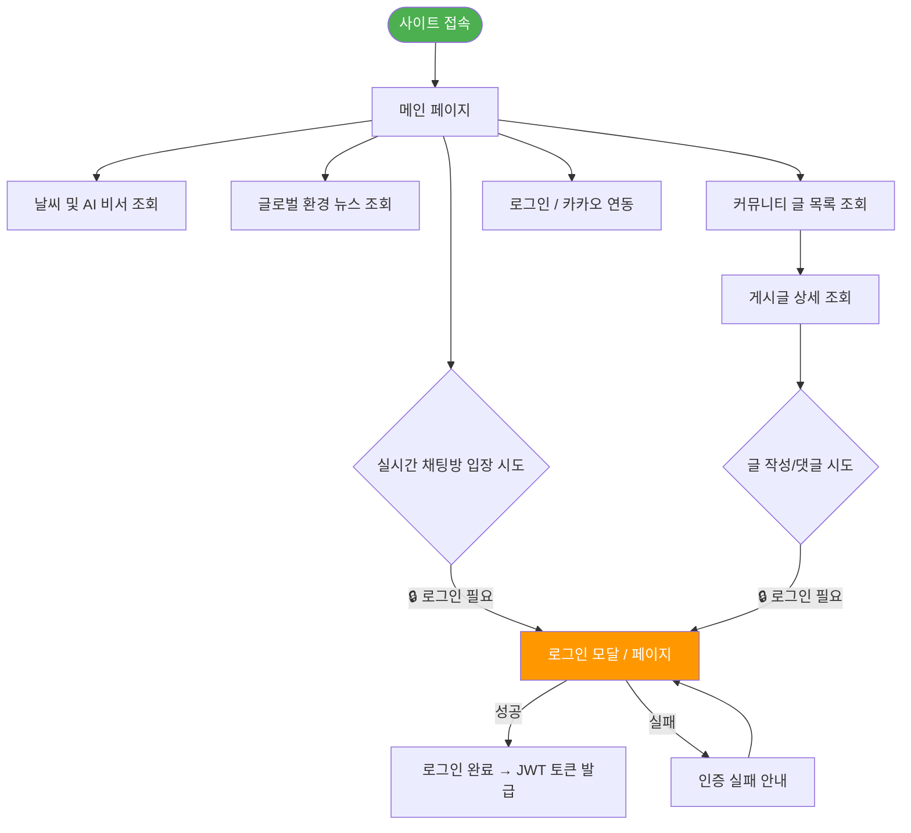
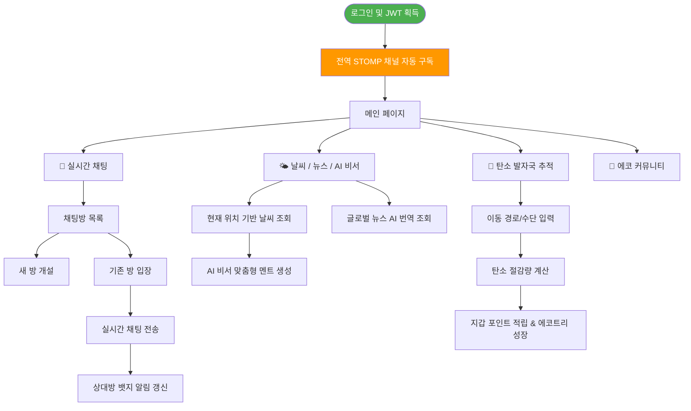
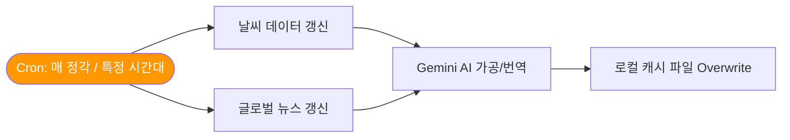

# 🌊 EasyEarth 사용자 비즈니스 동선 정의 (User Flow)

> **사용자 경험(UX) 중심의 기능 프로세스 및 예외 처리 아키텍처**  
> 이 문서는 실시간 채팅 참여, 환경 데이터(날씨/뉴스) 조회, AI 비서 활용 등 플랫폼의 핵심 비즈니스 로직별 사용자 이동 경로와 시스템 자동화 프로세스를 다이어그램을 통해 정의합니다.

---

## 📑 목차
1. [역할별 권한 플로우](#1-역할별-권한-플로우)
2. [핵심 기능별 상세 플로우 (채팅 / 환경 비서)](#2-핵심-기능별-상세-플로우)
3. [시스템 자동화 로직 (Automation)](#3-시스템-자동화-로직-automation)
4. [통합 비즈니스 플로우 (Full Flow)](#4-통합-비즈니스-플로우-full-flow)

---

## 1. 역할별 권한 플로우

### 👁️ 비로그인 사용자 (Public)



### 👤 일반 사용자 (MEMBER)



---

## 2. 핵심 기능별 상세 플로우

### 💬 2.1 실시간 채팅 및 알림 플로우 (WebSocket/STOMP)


### 🌤️ 2.2 AI 비서 및 글로벌 뉴스 파이프라인


---

## 3. 시스템 자동화 로직 (Automation)

프로젝트의 운영 효율성을 높이고 외부 통신 지연을 방지하기 위해 백엔드에서 자동으로 수행되는 로직입니다.

### ⏰ 3.1 파일 캐시 자동 갱신 (DataScheduler)
외부 API의 쿼터 제한을 피하고 즉각적인 응답 속도를 제공하기 위해 서버 스케줄러가 백그라운드에서 데이터를 수집 및 가공합니다.



---

## 4. 통합 비즈니스 플로우 (Full Flow)

```mermaid
flowchart TD
    S([사이트 접속]) --> MAIN[🏠 메인 페이지]

    MAIN --> AUTH{로그인 상태 검증<br/>(JWT)}

    AUTH -->|"❌ 비로그인 (Public)"| GUEST["조회 전용<br/>(날씨/뉴스/게시글)"]
    AUTH -->|"✅ 인가됨 (Private)"| USER[전체 기능 이용 가능]

    %% 비로그인 → 로그인 유도
    GUEST -->|채팅/탄소기록 등 접근| LOGIN[로그인/카카오 연동]
    LOGIN -->|성공| USER

    %% 일반 사용자 기능
    USER --> U1["💬 실시간 채팅망 접속"]
    USER --> U2["🌤️ AI 환경 비서 소통"]
    USER --> U3["🌱 탄소 절감 활동"]
    USER --> U4["📋 에코 지갑/마이페이지"]

    U1 --> RESULT1["양방향 소통 및 알림 수신"]
    U2 --> RESULT2["환경 뉴스 및 조언 획득"]
    U3 --> RESULT3["포인트 획득 및 나무 성장"]

    style S fill:#4CAF50,color:#fff
    style MAIN fill:#2196F3,color:#fff
    style AUTH fill:#FF9800,color:#fff
    style GUEST fill:#9E9E9E,color:#fff
```
