# EasyEarth 사용자 비즈니스 동선 정의 (User Flow)

> **사용자 경험(UX) 중심의 기능 프로세스 및 예외 처리 아키텍처**  
> 이 문서는 실시간 채팅, AI 환경 비서, 퀘스트/퀴즈 참여, 에코 포인트 상점, 에코맵 탐색 등 플랫폼의 핵심 비즈니스 로직별 사용자 이동 경로와 시스템 자동화 프로세스를 다이어그램을 통해 정의합니다.

---

## 목차
1. [역할별 권한 플로우](#1-역할별-권한-플로우)
2. [핵심 기능별 상세 플로우](#2-핵심-기능별-상세-플로우)
3. [시스템 자동화 로직 (Automation)](#3-시스템-자동화-로직-automation)
4. [통합 비즈니스 플로우 (Full Flow)](#4-통합-비즈니스-플로우-full-flow)

---

## 1. 역할별 권한 플로우

### 비로그인 사용자 (Public)

### 일반 사용자 (MEMBER)

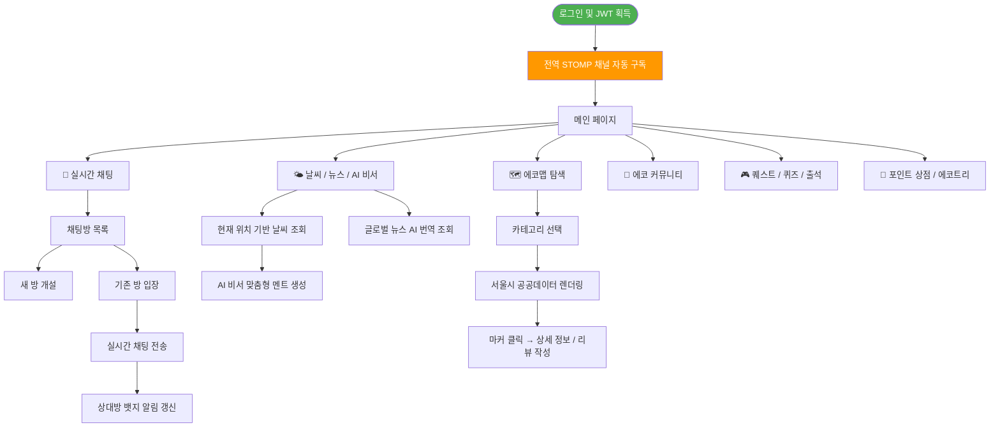

---

## 2. 핵심 기능별 상세 플로우

### 2.1 실시간 채팅 및 알림 플로우 (WebSocket/STOMP)

로그인 시점에 전역 알림 채널을 구독하여, 사용자가 어떤 페이지에 있든 실시간 알림을 수신합니다.

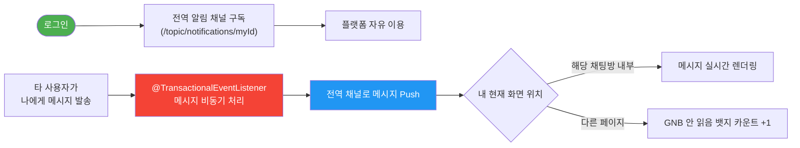

### 2.2 AI 비서 및 글로벌 뉴스 파이프라인

외부 API 의존도와 응답 지연을 최소화하기 위해 FileCache 기반의 2-레이어 캐싱 전략을 채택했습니다.

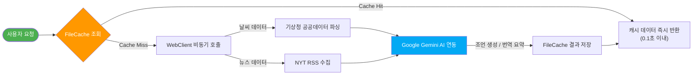

### 2.3 데일리 퀘스트 플로우 (사진 인증)

매일 초기화되는 퀘스트 목록에서 사진을 업로드하여 인증하면 포인트가 적립됩니다. 중복 인증은 서버에서 차단됩니다.

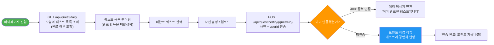

### 2.4 환경 퀴즈 플로우 (난이도별 일일 제한)

난이도별(Easy/Normal/Hard)로 하루 1회 참여 제한이 있습니다. 정답 시 포인트가 차등 지급됩니다.

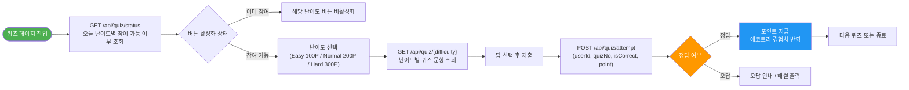

### 2.5 출석 체크 플로우 (연속 출석 보너스)

하루 1회 출석 체크로 포인트를 획득합니다. 중복 체크는 서버에서 `-1` 반환으로 차단됩니다.

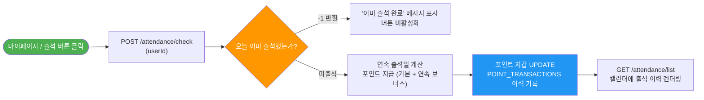

### 2.6 에코트리 성장 플로우 (포인트 연동)

회원 가입 시 트리거로 자동 생성된 에코트리가 누적 포인트에 따라 성장합니다.

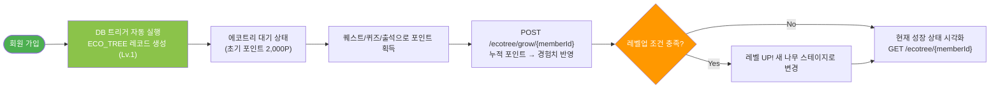

### 2.7 포인트 상점 & 랜덤 뽑기 플로우

포인트로 뱃지/배경/칭호를 구매하거나, 랜덤 뽑기로 아이템을 획득합니다. 중복 뽑기 시 500P 환급됩니다.

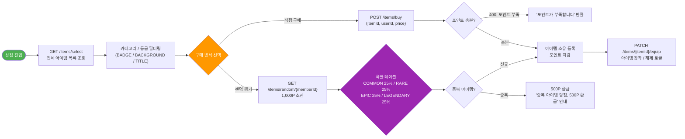

### 2.8 에코맵 탐색 및 리뷰 플로우 (공공데이터 동적 동기화)

서울시 공공데이터를 실시간으로 불러오며, 사용자가 처음 클릭한 장소는 DB에 자동 저장됩니다.

```mermaid
flowchart LR
    S([에코맵 진입]) --> CAT["카테고리 선택<br/>(제로웨이스트샵 / 재활용 정거장 / 약수터 등)"]
    CAT --> FETCH["서울시 공공데이터 API 호출<br/>(contsId 기반)"]
    FETCH --> RENDER["카카오맵 마커 클러스터 렌더링"]
    
    RENDER --> CLICK["마커 클릭"]
    CLICK --> SYNC{"로컬 DB에 해당 장소 존재?"}
    SYNC -->|"최초 클릭"| INSERT["ECO_SHOP 레코드 자동 생성<br/>(contsId 기준 자동 동기화)"]
    SYNC -->|"기존 장소"| DETAIL["장소 상세 정보 표시"]
    INSERT --> DETAIL
    
    DETAIL --> REVIEW["리뷰 조회<br/>GET /eco/review/list/{shopId}"]
    REVIEW --> WRITE{"리뷰 작성 시도"}
    WRITE -->|"비로그인"| LOGIN["로그인 유도"]
    WRITE -->|"로그인"| POST["POST /eco/review/write<br/>평점 + 내용 저장"]
    POST --> AVG["DB 트리거 자동 실행<br/>AVG_RATING 즉시 재계산"]

    style S fill:#4CAF50,color:#fff
    style SYNC fill:#FF9800,color:#fff
    style AVG fill:#2196F3,color:#fff
```

---

## 3. 시스템 자동화 로직 (Automation)

프로젝트의 운영 효율성을 높이고 외부 통신 지연을 방지하기 위해 백엔드에서 자동으로 수행되는 로직입니다.

### 3.1 파일 캐시 자동 갱신 (DataScheduler)
외부 API의 쿼터 제한을 피하고 즉각적인 응답 속도를 제공하기 위해 서버 스케줄러가 백그라운드에서 데이터를 수집 및 가공합니다.

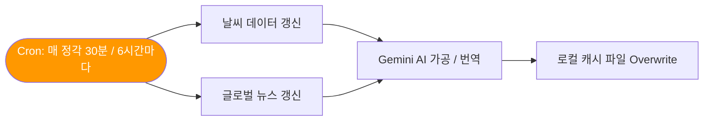

### 3.2 이력 자동 정리 (HistoryScheduler)
매일 자정 `INTEGRATED_HISTORY` 테이블에 남은 미완료(`P: Pending`) 이력을 일괄 삭제하여 다음날 새로운 퀘스트/퀴즈 참여 기회를 보장합니다.

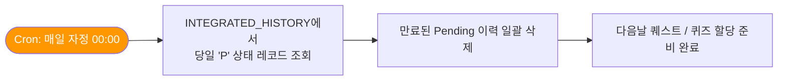

---

## 4. 통합 비즈니스 플로우 (Full Flow)

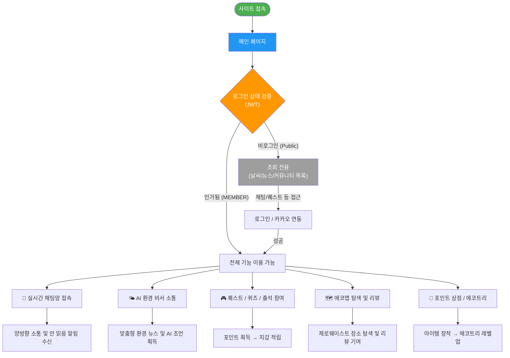
