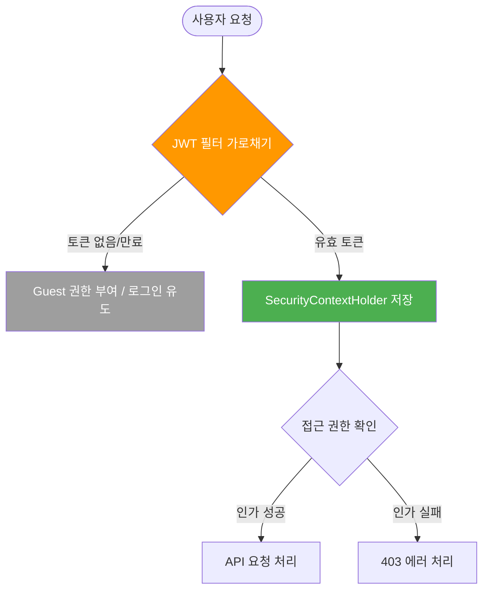
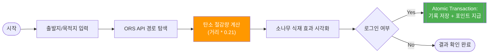
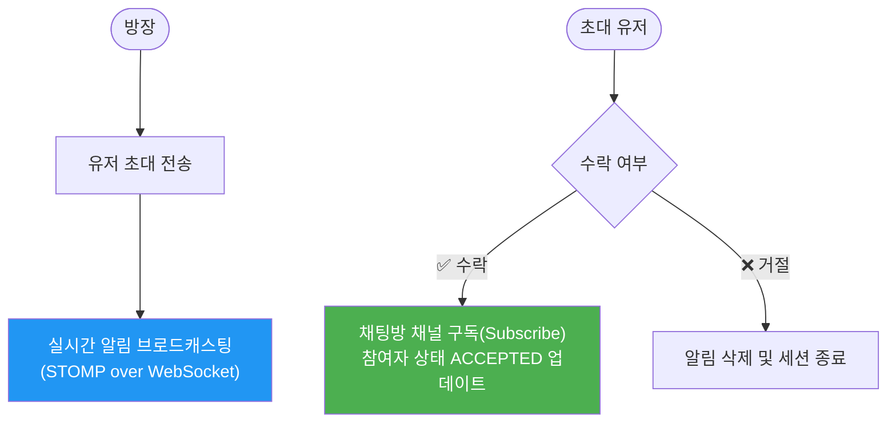
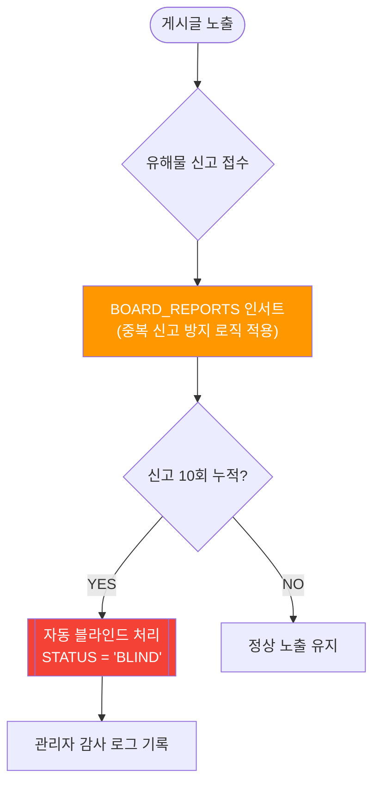
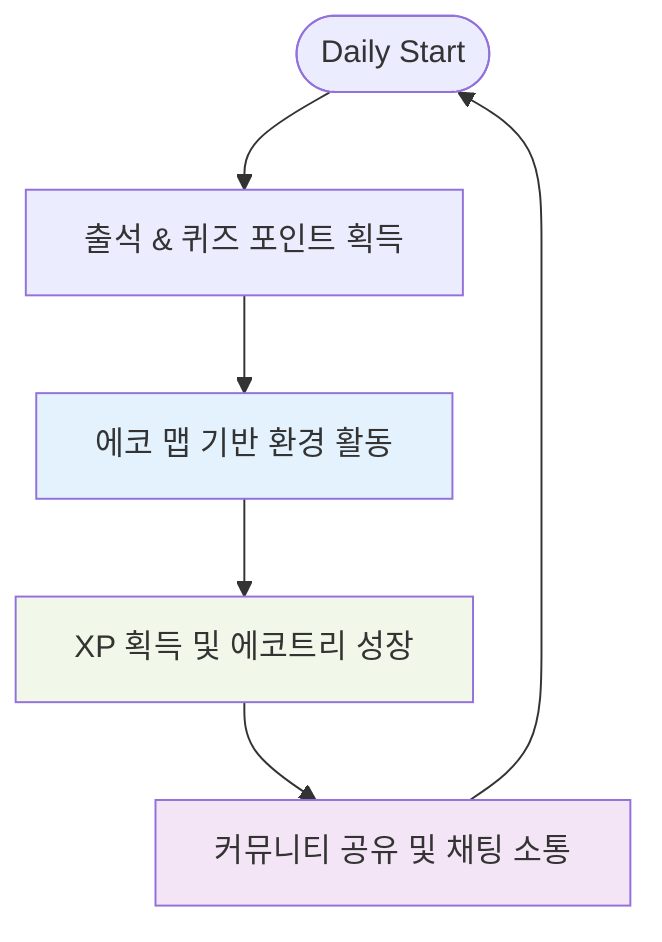

# 🌍 EasyEarth 파이널 프로젝트 User Flow

> **사용자 경험(UX) 및 비즈니스 로직 기반 서비스 시나리오**  
> 이 문서는 핵심 기능별 프로세스, 예외 처리, 그리고 백엔드의 원자적 트랜잭션 흐름을 정의합니다.

---

## 📑 목차
1. [프로세스 설계 및 예외 처리 원칙 (Technical Note)](#-프로세스-설계-및-예외-처리-원칙-technical-note)
2. [역할별 권한 및 인증 플로우](#1-역할별-권한-및-인증-플로우)
3. [핵심 비즈니스 로직 플로우](#2-핵심-비즈니스-로직-플로우)
4. [통합 서비스 라이프사이클 (The Loop)](#3-통합-서비스-라이프사이클-the-loop)

---

## 💡 프로세스 설계 및 예외 처리 원칙 (Technical Note)
- **트랜잭션 원자성(Atomicity)**: 포인트 지급, 활동 기록 저장 등 연쇄적인 DB 작업은 `@Transactional`을 통해 하나의 논리적 단위로 묶어, 데이터 불일치가 발생하지 않는 **All-or-Nothing** 원칙을 준수했습니다.
- **비정상 접근 제어**: JWT 필터 레벨에서 유효하지 않은 토큰 접근을 차단하고, 비즈니스 로직 단에서도 소유권 검증(Owner Validation)을 재수행하는 **2중 방어 체계**를 구축했습니다.
- **실시간 예외 대응**: WebSocket 연결 유실 시 자동 재접속(Reconnection) 로직과 세션 정제 프로세스를 설계하여 사용자 이탈을 최소화했습니다.

## 1. 역할별 권한 및 인증 플로우

### 👤 유저 인증 및 보안 세션 (Stateless JWT)
> 세션 없이 토큰 기반으로 동작하는 보안 인증 프로세스입니다.

---

## 2. 핵심 비즈니스 로직 플로우

### 🌏 2.1 에코 맵 및 탄소 절감 산출 알고리즘
> 외부 API(ORS) 연동과 자체 탄소 계산 공식이 결합된 핵심 로직입니다.

### 💬 2.2 실시간 채팅 참여 핸드쉐이킹 (Socket)
> WebSocket 세션 수립 및 초대-수락 기반의 참여 프로세스입니다.

### 📝 2.3 커뮤니티 거버넌스 (Self-Moderation)
> 유저의 참여로 유해 콘텐츠를 자동 정화하는 블라인드 시스템입니다.

---

## 3. 통합 서비스 라이프사이클 (The Loop)

